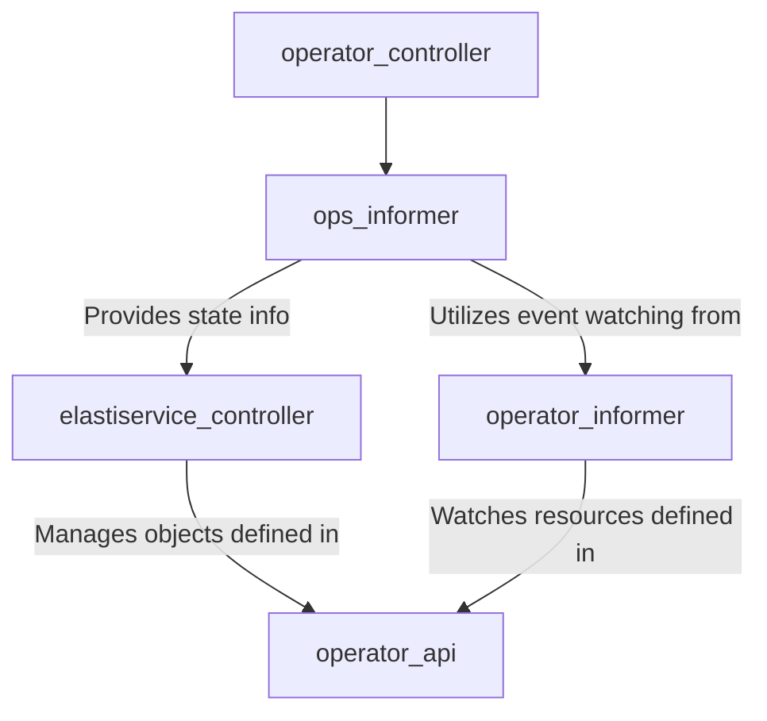

# ops_informer Module Documentation

The `ops_informer` module is a crucial component within the `operator`'s controller framework. It serves as an intermediary, responsible for capturing and processing real-time state changes of Kubernetes resources, particularly `ElastiService` objects, and making this information available to the main reconciliation logic.

## Purpose and Core Functionality

At its core, the `ops_informer` module's purpose is to abstract the complexities of Kubernetes watch mechanisms and present a simplified, actionable view of a resource's current state. This module ensures that the controller always operates with up-to-date information, which is vital for maintaining the desired state of managed resources like `ElastiService` instances.

### Core Component: `updateObjInfo`

The `operator.internal.controller.opsInformer.updateObjInfo` struct is the primary data structure managed and provided by this module. It encapsulates essential information about a Kubernetes object, enabling the controller to make informed decisions.

```go
type updateObjInfo struct {
        specReplicas   int64
        statusReplicas int64
        selector       map[string]interface{}
        namespace      string
        name           string
}
```

*   `specReplicas`: Represents the desired number of replicas as specified in the resource's spec.
*   `statusReplicas`: Indicates the current number of active replicas reported in the resource's status.
*   `selector`: A map of labels used to identify and select associated pods or resources.
*   `namespace`: The Kubernetes namespace where the resource resides.
*   `name`: The name of the Kubernetes resource.

This information is critical for components like the [elastiservice_controller](elastiservice_controller.md) to compare desired versus actual states and initiate reconciliation actions, such as scaling up or down.

## Architecture and Component Relationships

The `ops_informer` module is tightly integrated into the `operator_controller` ecosystem, acting as a data provider to the reconciliation loop. It relies on the generic `operator_informer` module to set up watches on Kubernetes resources and then processes the events to construct `updateObjInfo` instances.



*   **`operator_informer`:** The `ops_informer` module leverages components like `RequestWatch` and `KeyParams` from the [operator_informer](operator_informer.md) module to establish watches on `ElastiService` Custom Resources (CRs). This allows `ops_informer` to receive notifications about additions, updates, and deletions of `ElastiService` objects.
*   **`operator_api`:** The definition of the `ElastiService` Custom Resource, including its `ElastiServiceSpec` and `ElastiServiceStatus`, is provided by the [operator_api](operator_api.md) module. `ops_informer` processes events related to these API objects to populate the `updateObjInfo` struct.
*   **`elastiservice_controller`:** The primary consumer of the information generated by `ops_informer` is the [elastiservice_controller](elastiservice_controller.md). The `updateObjInfo` struct provides the necessary data points for the `ElastiServiceReconciler` to perform its reconciliation logic, ensuring the actual state of `ElastiService` resources matches their desired state.

## How the Module Fits into the Overall System

The `ops_informer` module acts as a critical bridge in the operator's control plane. It sits between the raw event stream from the Kubernetes API server (channeled through the `operator_informer`) and the intelligent decision-making logic of the `elastiservice_controller`. By standardizing and delivering crucial state information, it enables the operator to react promptly and accurately to changes in the Kubernetes environment, facilitating efficient and reliable management of `ElastiService` instances. Without `ops_informer`, the controller would lack the real-time awareness needed for effective resource management and scaling operations.