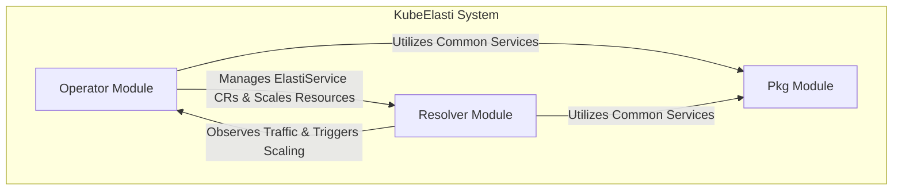

KubeElasti is a Kubernetes-native autoscaling solution designed to dynamically manage and scale services based on real-time traffic and resource utilization. It comprises a `Resolver` module that acts as a reverse proxy, observing incoming requests and applying traffic management policies, and an `Operator` module that orchestrates the scaling of `ElastiService` custom resources within the Kubernetes cluster. A shared `Pkg` module provides common utilities and foundational services to both core components, ensuring efficient and responsive resource management.

