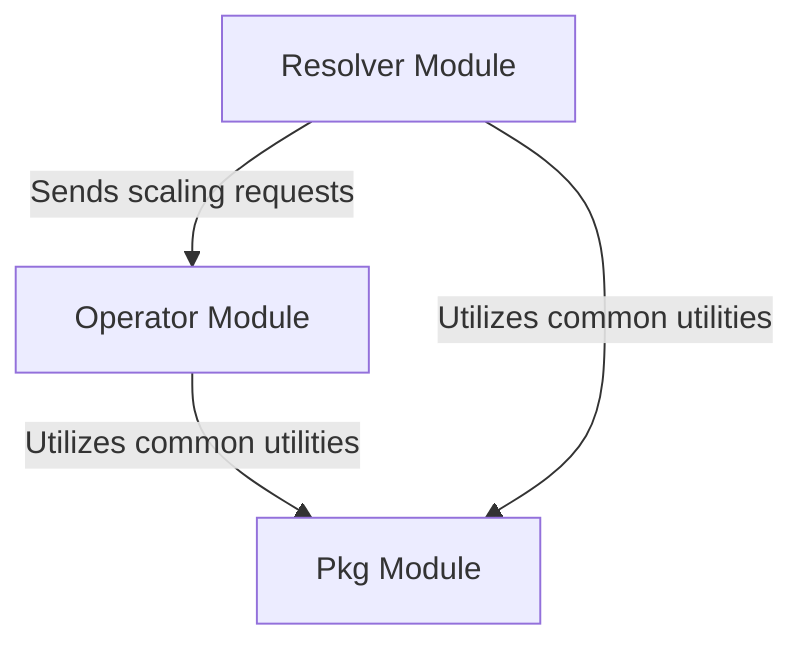

The KubeElasti repository provides a Kubernetes-native autoscaling solution designed to dynamically manage service resources based on real-time traffic and custom scaling policies. It integrates an intelligent reverse proxy with a Kubernetes operator to achieve efficient and responsive scaling.

The repository is structured around three core modules:

*   **Resolver**: Acts as an intelligent reverse proxy and traffic manager, routing incoming requests, applying throttling, and communicating with the operator for scaling insights.
*   **Operator**: Orchestrates scaling actions within Kubernetes by managing custom resource definitions (`ElastiService`) and reconciling the desired state with the actual cluster state.
*   **Pkg**: A foundational library providing common utilities, data structures, and shared functionalities essential for Kubernetes operations, scaling mechanisms, and inter-service communication across the other modules.

### Architecture Overview

