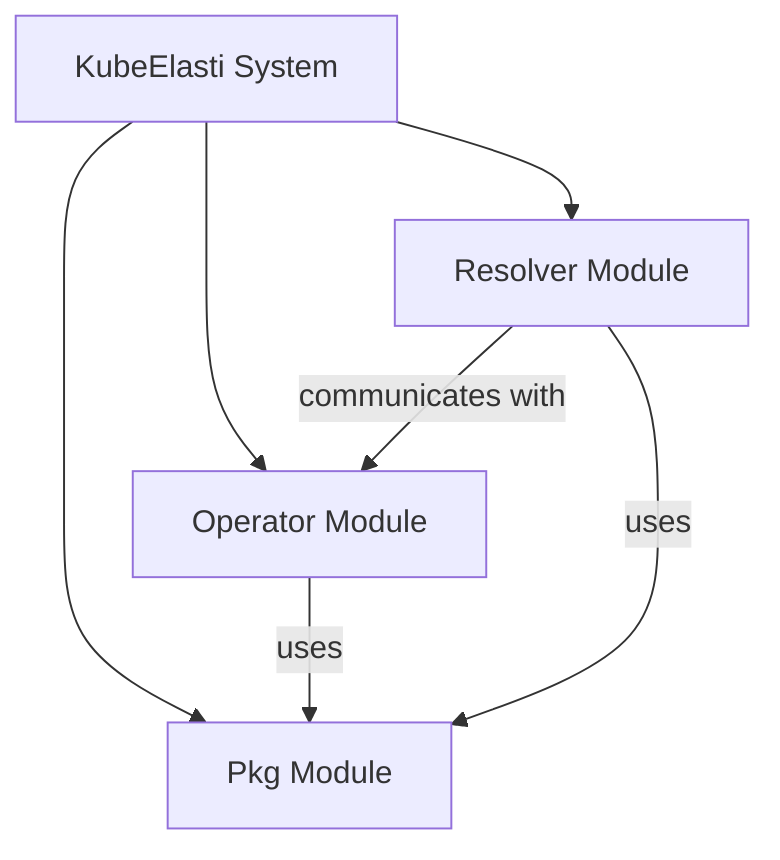

KubeElasti is a Kubernetes-native autoscaling solution designed to manage and dynamically scale applications based on custom resource definitions and real-time traffic. It comprises an operator that orchestrates the lifecycle and scaling of services within Kubernetes, and a resolver that acts as an intelligent reverse proxy, handling traffic, applying throttling, and informing scaling decisions. The repository aims to provide a robust and flexible framework for efficient resource utilization and maintaining service availability under varying loads.

### Architecture Overview

The KubeElasti repository is structured around three core modules: the `Operator`, the `Resolver`, and a shared `Pkg` (package) module.

The **Operator Module** is responsible for defining and managing `ElastiService` custom resources, acting as the control plane for autoscaling within Kubernetes. It watches for changes to these resources and reconciles the desired state.

The **Resolver Module** functions as an intelligent reverse proxy and traffic manager. It routes incoming requests to appropriate backend services, implements load balancing, throttling, and communicates with the Operator to influence scaling decisions based on real-time load.

The **Pkg Module** provides common utilities, configurations, and shared data structures used by both the Operator and Resolver, ensuring consistency and reusability across the system.

