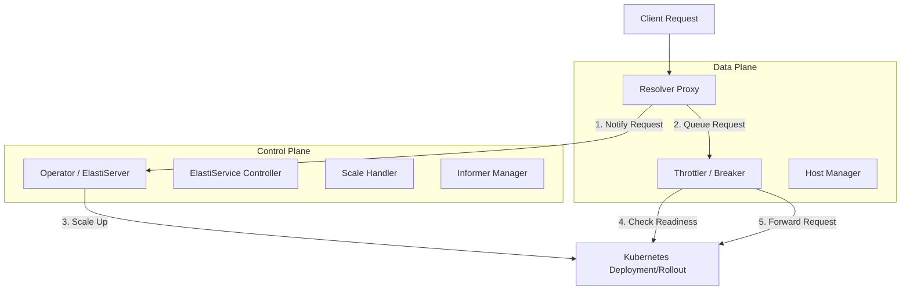

# KubeElasti Overview

## Purpose
KubeElasti is a Kubernetes-native autoscaling solution designed to provide "scale-to-zero" capabilities for any service. It enables efficient resource utilization by scaling services down to zero replicas when idle and automatically scaling them up when traffic arrives. The system ensures that no requests are lost during the "cold start" phase by intercepting and queuing traffic until the target service is ready.

## End-to-End Architecture
The KubeElasti architecture is divided into a **Data Plane** (Resolver) and a **Control Plane** (Operator). The Resolver acts as a reverse proxy that manages request lifecycle, while the Operator handles the Kubernetes resource management and scaling logic.

## Core Modules

The repository is organized into three primary functional areas:

### [Resolver](resolver.md)
The high-performance data plane component. It identifies target services via headers, manages request queuing using a circuit breaker pattern, and monitors service readiness before forwarding traffic.

### [Operator](operator.md)
The control plane component responsible for managing the lifecycle of `ElastiService` Custom Resources. It reconciles state, watches Kubernetes resources via Informers, and executes scaling actions based on metrics or incoming request notifications from the Resolver.

### [Shared Packages](pkg.md)
A collection of common utilities and logic used across the system, including:
*   **Scaling**: Core logic for different scaler types (e.g., Prometheus).
*   **Config**: Environment-based configuration management.
*   **K8sHelper**: Simplified interactions with the Kubernetes API.
*   **Logger**: Structured logging and observability integrations.