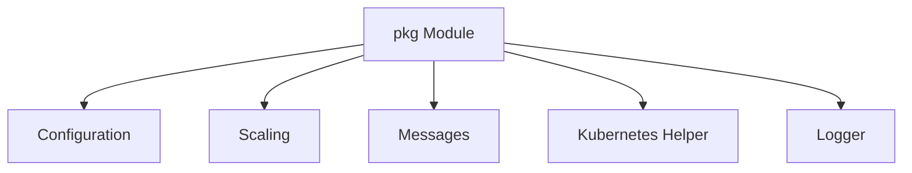

# pkg Module Documentation

## Introduction

The `pkg` module provides foundational utilities, configurations, and common data structures used across the operator and resolver services. It encapsulates essential functionalities such as Kubernetes interaction helpers, logging, scaling interfaces, and message definitions.

## Architecture Overview

The `pkg` module is structured into several sub-modules, each addressing a specific area of functionality. These sub-modules are designed to be loosely coupled, promoting reusability and maintainability.

## High-level Functionality

- **Configuration (`config`)**: Manages service configurations for both the operator and resolver components.
- **Scaling (`scaling`)**: Provides interfaces and implementations for handling service scaling, including interaction with Kubernetes and external metrics sources like Prometheus.
- **Messages (`messages`)**: Defines common message structures exchanged between different components, such as host information and request counts.
- **Kubernetes Helper (`k8shelper`)**: Offers utility functions for interacting with the Kubernetes API.
- **Logger (`logger`)**: Implements custom logging functionalities for consistent output.

