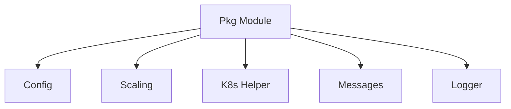

# Pkg Module Documentation

## Introduction
The `pkg` module serves as a foundational library within the system, providing essential utilities, configurations, and common data structures that are leveraged by other core modules such as `operator` and `resolver`. It encapsulates cross-cutting concerns like Kubernetes client operations, logging, inter-module message formats, and scaling interfaces, ensuring a consistent and standardized approach across the application.

## Architecture Overview
The `pkg` module is structured into several sub-modules, each responsible for a specific set of functionalities. This modular design promotes reusability, maintainability, and clear separation of concerns. The overall architecture of the `pkg` module and its internal dependencies are depicted in the following diagram:

## Sub-modules Functionality

### [Config Module](config.md)
This sub-module handles all configuration-related aspects of the system, including general application settings and specific configurations for the resolver component. It provides structured types to define and manage various configuration parameters.

### [Scaling Module](scaling.md)
Dedicated to managing the scaling logic for services. It defines interfaces for different types of scalers and includes implementations for specific scaling mechanisms, such as Prometheus-based scaling. This module is critical for dynamic resource management.

### [K8s Helper Module](k8shelper.md)
Provides a wrapper around Kubernetes client operations, simplifying interactions with the Kubernetes API. It abstracts away the complexities of direct Kubernetes API calls, offering a consistent interface for managing Kubernetes resources.

### [Messages Module](messages.md)
Defines the data structures used for inter-module communication. It includes message formats for host information and operator-related requests, facilitating clear and structured data exchange between different parts of the system.

### [Logger Module](logger.md)
Offers custom logging functionalities. It provides a structured way to log events and errors within the application, enhancing observability and debugging capabilities.
