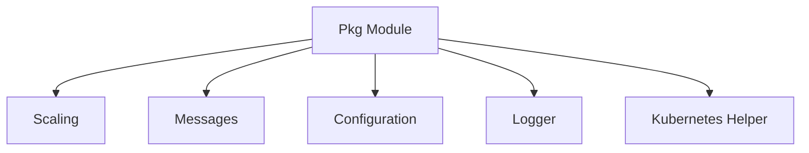

# Pkg Module Documentation

## Introduction

The `pkg` module serves as a foundational library within the system, encapsulating common functionalities, data structures, and utilities essential for various components, particularly those related to Kubernetes operations, scaling mechanisms, and inter-service communication. It provides reusable interfaces and implementations to streamline development and ensure consistency across the application.

## Architecture Overview

The `pkg` module is structured into several key sub-modules, each responsible for a specific domain of functionality. The architecture is designed to promote modularity, reusability, and clear separation of concerns. Below is a high-level overview of the `pkg` module's architecture.

## Sub-modules Overview

### Scaling

The `scaling` sub-module provides interfaces and implementations for managing the scaling logic of services. It defines how services can be scaled up or down based on various metrics and conditions. This includes core interfaces for scalers and handlers for managing scaling operations.

### Messages

The `messages` sub-module defines the data structures used for inter-service communication and internal data representation. It includes definitions for host-related information and request counts, facilitating clear and consistent data exchange.

### Configuration

The `config` sub-module handles the application's configuration, providing structures to define and manage various settings, including Resolver-specific configurations and general application parameters.

### Logger

The `logger` sub-module provides custom logging functionalities, extending standard logging capabilities to better suit the application's needs for structured and efficient logging.

### Kubernetes Helper

The `k8shelper` sub-module offers utility functions and clients for interacting with the Kubernetes API. It simplifies common Kubernetes operations, making it easier for other modules to manage resources within a Kubernetes cluster.
