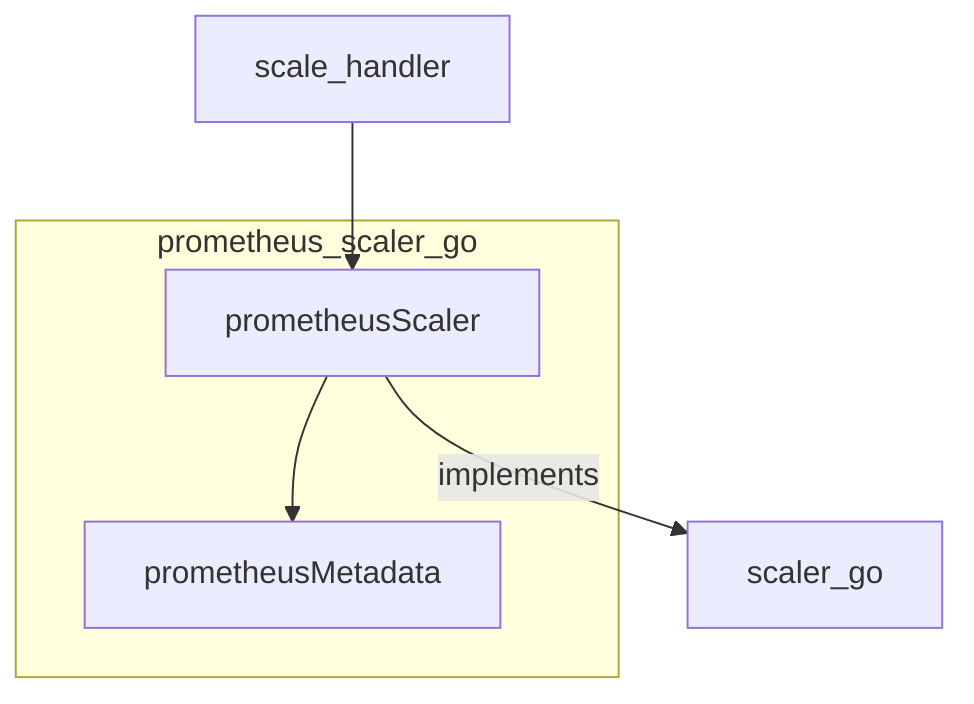

# prometheus_scaler_go Module Documentation

## Introduction
The `prometheus_scaler_go` module, located within `pkg/scaling/scalers`, is responsible for providing a Prometheus-based scaling mechanism. This module implements the `Scaler` interface and uses Prometheus metrics to determine when and how to scale services. It defines the necessary metadata for Prometheus queries and the scaler logic to interact with a Prometheus server.

## Architecture and Component Relationships

The `prometheus_scaler_go` module is a concrete implementation of the `scaler_go` interface. It is utilized by the `scale_handler` module to perform scaling decisions based on Prometheus metrics. Internally, it comprises `prometheusScaler` which encapsulates the scaling logic and `prometheusMetadata` which holds the configuration for Prometheus queries.

## Core Components

### `prometheusMetadata`
(`pkg.scaling.scalers.prometheus_scaler.prometheusMetadata`)

This struct defines the configuration parameters required for a Prometheus scaling operation. It specifies details about the Prometheus server, the query to execute, and the conditions for scaling.

**Fields:**
*   `ServerAddress` (string): The address of the Prometheus server.
*   `Query` (string): The PromQL query to execute to fetch the metric data.
*   `Threshold` (float64): The target threshold value for the metric. If the query result exceeds or falls below this threshold (depending on the scaling logic), a scaling action might be triggered.
*   `UptimeFilter` (string): An optional filter to apply based on the uptime of the target.
*   `Headers` (map[string]string): Custom HTTP headers to be included in the requests to the Prometheus server.

### `prometheusScaler`
(`pkg.scaling.scalers.prometheus_scaler.prometheusScaler`)

The `prometheusScaler` struct implements the core logic for scaling services based on Prometheus metrics. It utilizes the `prometheusMetadata` to configure its operations and interacts with a Prometheus server via an HTTP client to retrieve metric data. This component is expected to implement the `Scaler` interface defined in `scaler_go.md`.

**Fields:**
*   `httpClient` (*http.Client): An HTTP client used to make requests to the Prometheus server.
*   `metadata` (*prometheusMetadata): A pointer to the `prometheusMetadata` containing the specific configuration for the current scaling operation.
*   `cooldownPeriod` (time.Duration): The duration to wait between scaling actions to prevent rapid, successive scaling.
*   `defaultServerAddress` (string): The default Prometheus server address to use if not specified in the metadata.
*   `defaultHeaders` (map[string]string): Default HTTP headers to include in Prometheus requests.
