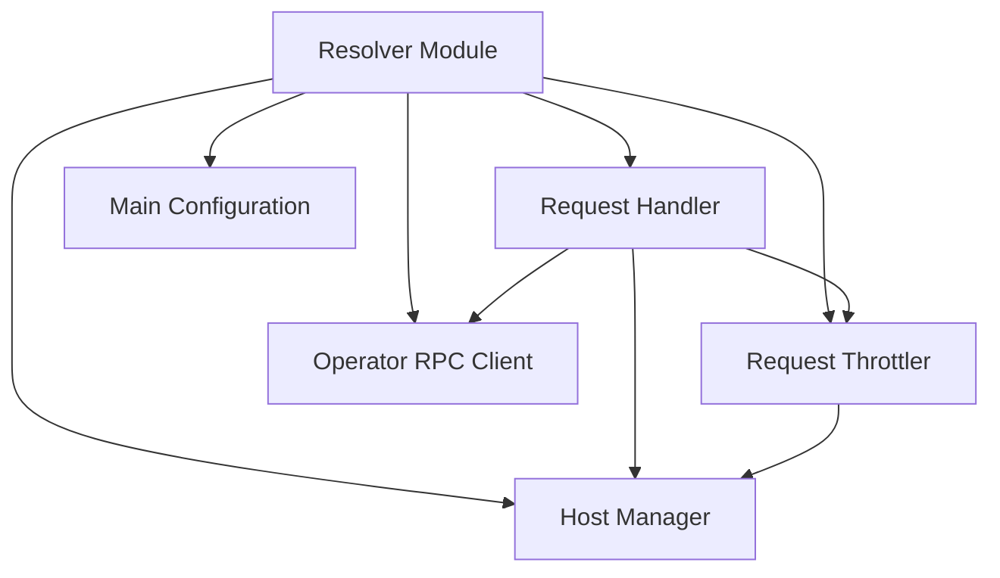

# Resolver Module Documentation

## Introduction
The `resolver` module acts as a reverse proxy and intelligent request handler within the system. Its primary responsibility is to route incoming HTTP requests to appropriate backend services, manage host traffic, apply throttling mechanisms, and communicate with the `operator` module for scaling and operational insights.

## Architecture Overview

## Sub-modules

*   **Request Handler ([`handler.md`](handler.md))**: Manages incoming HTTP requests, applies throttling, and interacts with host management and the operator.
*   **Request Throttler ([`throttler.md`](throttler.md))**: Implements circuit breaking and concurrency control to protect backend services.
*   **Operator RPC Client ([`operator_client.md`](operator_client.md))**: Handles communication with the `operator` module to send request information and receive operational commands.
*   **Host Manager ([`host_manager.md`](host_manager.md))**: Manages the state and traffic distribution across different backend hosts.
*   **Main Configuration ([`main_config.md`](main_config.md))**: Defines the overall configuration parameters for the resolver.
