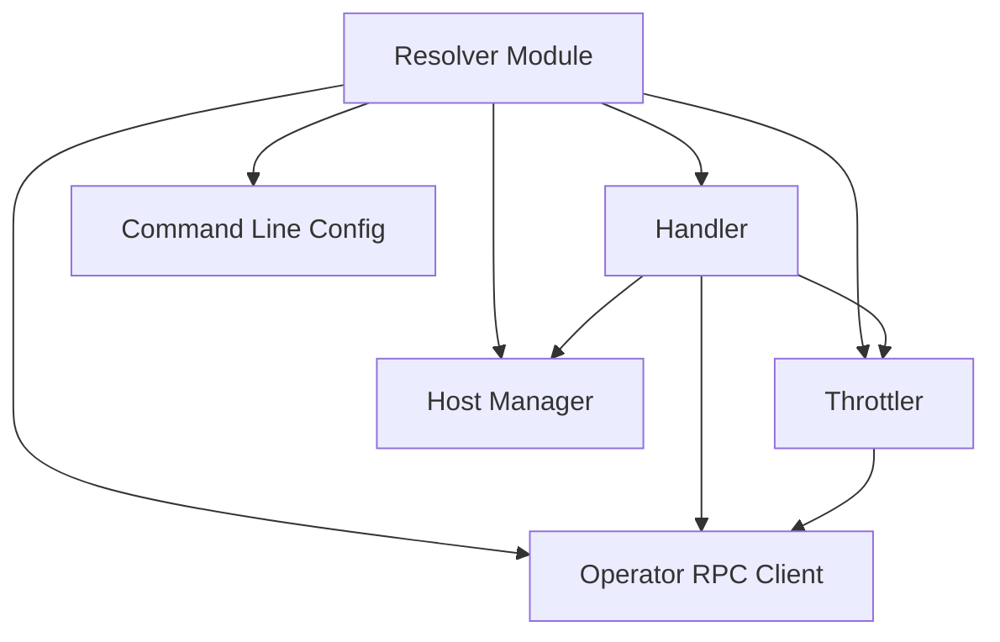

# Resolver Module Documentation

## Introduction

The `resolver` module is a critical component responsible for routing incoming requests to appropriate backend services, applying traffic management policies like throttling and circuit breaking, and interacting with the `operator` module for scaling and service information. It acts as a reverse proxy, intelligently distributing requests based on various factors, ensuring system stability and optimal resource utilization.

## Architecture Overview

The `resolver` module is composed of several key sub-modules that work in conjunction to handle request processing, host management, and communication with the operator.

## Sub-modules High-Level Functionality

### [Throttler](throttler.md)
The `throttler` sub-module implements traffic control mechanisms, including circuit breaking and request queuing, to prevent service overload and ensure graceful degradation under high load.

### [Handler](handler.md)
The `handler` sub-module is the core request processing component. It manages incoming HTTP requests, interacts with the `throttler` for traffic management, communicates with the `hostmanager` to determine the target host, and sends relevant information to the `operator` module.

### [Operator RPC Client](operator_rpc_client.md)
The `operator` sub-module provides an RPC client for communication with the main `operator` module. It is responsible for sending information about incoming requests and service status to the operator, which in turn uses this data for scaling decisions.

### [Host Manager](hostmanager.md)
The `hostmanager` sub-module is responsible for managing the available hosts for different services. It provides functionalities to get a suitable host for an incoming request and to disable traffic to specific hosts when necessary.

### [Command Line Config](cmd_config.md)
The `cmd` sub-module handles the command-line configuration for the resolver, defining various parameters such as timeouts, queue sizes, and concurrency limits.
