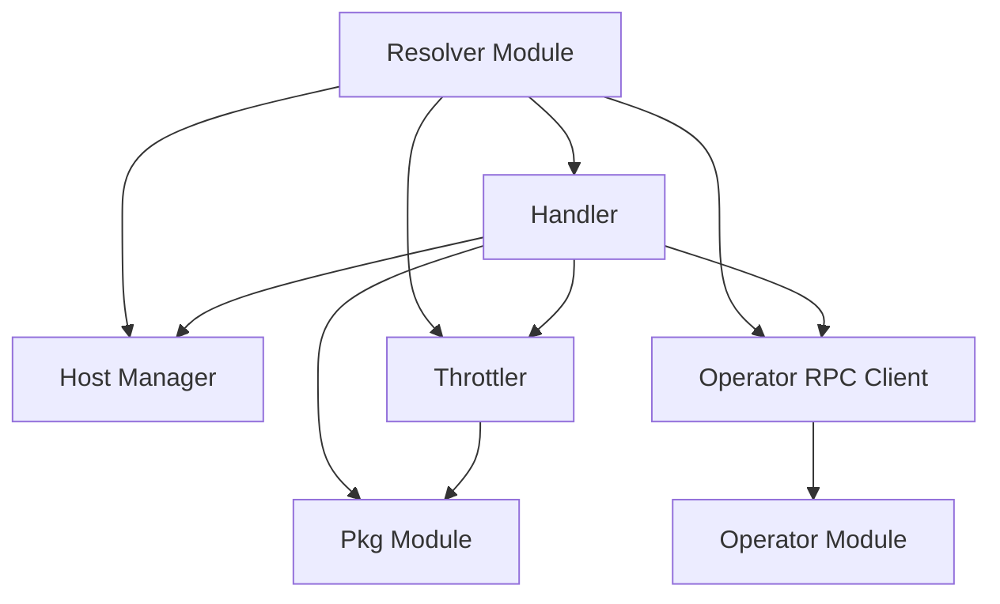

# Resolver Module Documentation

## Introduction
The Resolver module acts as a crucial component in the system, primarily functioning as a reverse proxy and intelligent traffic manager. Its core responsibility is to route incoming requests to appropriate backend services while implementing advanced features like load balancing, throttling, and autoscaling integration. It ensures efficient resource utilization and maintains service availability under varying loads.

## Architecture Overview
The Resolver module is composed of several key sub-modules that work in conjunction to handle incoming requests, manage host states, and interact with the operator for scaling decisions. The overall architecture is designed for high performance and resilience.

## High-Level Functionality

### Handler Sub-module
The `handler` sub-module is responsible for processing incoming HTTP requests, acting as the main entry point for traffic. It integrates with the `hostmanager` to determine the target host, applies throttling rules via the `throttler`, and communicates with the `operator_rpc` for scaling events.
Refer to [Handler Documentation](handler.md) for more details.

### Host Manager Sub-module
The `hostmanager` sub-module is responsible for maintaining the state of available hosts and managing traffic distribution to them. It can disable traffic to unhealthy hosts and re-enable them after a specified duration, ensuring requests are only sent to healthy backends.
Refer to [Host Manager Documentation](hostmanager.md) for more details.

### Throttler Sub-module
The `throttler` sub-module implements mechanisms to control the rate of requests processed by the resolver. It uses circuit breakers and semaphores to prevent system overload, protect backend services, and manage request queues.
Refer to [Throttler Documentation](throttler.md) for more details.

### Operator RPC Client Sub-module
The `operator_rpc` sub-module handles communication with the external `operator` module. It is responsible for informing the operator about incoming request information, which the operator uses to make autoscaling decisions.
Refer to [Operator RPC Client Documentation](operator.md) for more details.

## Key Configuration
The resolver module's behavior is controlled by various configuration parameters defined in `resolver.cmd.main.config`. These parameters include:
- `MaxIdleProxyConns`: Maximum idle connections for the proxy.
- `MaxIdleProxyConnsPerHost`: Maximum idle connections per host.
- `ReqTimeout`: Timeout for individual requests.
- `TrafficReEnableDuration`: Duration for which traffic is disabled for a host.
- `OperatorRetryDuration`: Duration to wait before retrying the operator for the same host.
- `QueueRetryDuration`: Duration after which requests in the queue are retried.
- `QueueSize`: Size of the request queue.
- `MaxQueueConcurrency`: Maximum concurrent requests for the queue.
- `InitialCapacity`: Initial capacity for the semaphore.
- `HeaderForHost`: HTTP header to use for identifying the host.
- `SentryDsn`, `SentryEnv`: Sentry configuration for error tracking.
- `EnableH2C`: Flag to enable H2C (HTTP/2 Cleartext).

These settings are crucial for fine-tuning the resolver's performance and resilience characteristics.
