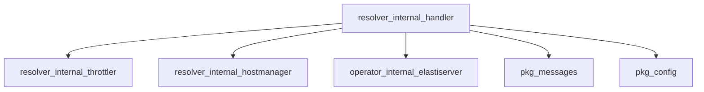

# resolver.internal.handler Module Documentation

## Introduction and Purpose

The `resolver.internal.handler` module is a core component within the `resolver` service, primarily responsible for handling incoming HTTP requests, managing host traffic, and coordinating with other internal services like the throttler, host manager, and operator. It acts as a reverse proxy, ensuring requests are properly routed, managed, and responses are handled efficiently. This module is crucial for the `resolver` to correctly direct client requests to appropriate backend services and manage their lifecycle.

## Architecture Overview

The `resolver.internal.handler` module is central to the request processing flow. It utilizes several key interfaces and components:

*   **`Throttler`**: From the `resolver_internal_throttler` module, it manages request rates to prevent system overload.
*   **`HostManager`**: From the `resolver_internal_hostmanager` module (implemented by `resolver.internal.hostmanager.hostManager.HostManager`), it's responsible for selecting and managing target hosts for incoming requests, as well as controlling traffic to them.
*   **`Operator`**: An interface (likely implemented by a component in the `operator_internal_elastiserver` module) for communicating with the main operator, primarily to send information about incoming requests.
*   **`http.RoundTripper`**: Used for executing individual HTTP transactions, providing a mechanism for custom transport logic.
*   **`httputil.BufferPool`**: Optimizes memory usage by managing a pool of byte buffers, used for handling HTTP request and response bodies.

The module integrates these components to form a robust request handling pipeline.

## Module Relationships

The following diagram illustrates the relationships and dependencies of the `resolver_internal_handler` module with other parts of the system:



## Core Components and Functionality

### `resolver.internal.handler.handler.HostManager` (Interface)

**Source File**: `resolver/internal/handler/handler.go` (Lines 49-55)

```go
type HostManager interface {
    GetHost(req *http.Request) (*messages.Host, error)
    DisableTrafficForHost(service string)
}
```

This interface defines the contract for managing target hosts. Implementations of this interface are responsible for:
*   **`GetHost(req *http.Request) (*messages.Host, error)`**: Determining and retrieving the appropriate backend host for a given HTTP request.
*   **`DisableTrafficForHost(service string)`**: Instructing the system to stop sending traffic to a specified service, typically used during scaling operations or health issues.

This interface is fulfilled by the `resolver.internal.hostmanager.hostManager.HostManager` component, linking directly to the [Host Manager Module](resolver_internal_hostmanager.md) for its detailed implementation.

### `resolver.internal.handler.handler.Response`

**Source File**: `resolver/internal/handler/handler.go` (Lines 70-72)

```go
type Response struct {
    Message string `json:"message"`
}
```

A simple Go struct used to define a standard JSON response payload. It contains a single `Message` field, typically used for returning informational messages or error details to the client.

### `resolver.internal.handler.handler.bufferPool`

**Source File**: `resolver/internal/handler/handler.go` (Lines 246-248)

```go
type bufferPool struct {
    pool *sync.Pool
}
```

This type implements the `httputil.BufferPool` interface, providing an efficient way to manage and reuse byte buffers. It leverages `sync.Pool` to reduce memory allocations and garbage collection overhead, particularly when dealing with large numbers of HTTP request and response bodies. This is crucial for performance in a high-throughput proxy.

### `resolver.internal.handler.handler.QueueStatusResponse`

**Source File**: `resolver/internal/handler/handler.go` (Lines 74-76)

```go
type QueueStatusResponse struct {
    QueueStatus int `json:"queueStatus"`
}
```

A Go struct designed to convey the status of a request within a processing queue. It includes a `QueueStatus` integer field, which can be used to indicate various states, such as waiting, processed, or an error condition related to queueing.

### `resolver.internal.handler.writer.responseWriter`

**Source File**: `resolver/internal/handler/writer.go` (Lines 8-12)

```go
type responseWriter struct {
    http.ResponseWriter
    statusCode int
    body       []byte
}
```

A custom implementation of `http.ResponseWriter` that wraps the standard writer. This custom writer allows the `resolver.internal.handler` to intercept and capture the HTTP status code and the response body before they are sent back to the client. This functionality is vital for:
*   **Logging**: Recording the actual response sent.
*   **Metrics**: Extracting information like response size or status for monitoring.
*   **Modification**: Potentially altering the response content or headers based on internal logic before it reaches the client.
*   **Error Handling**: Providing more detailed or standardized error responses.
