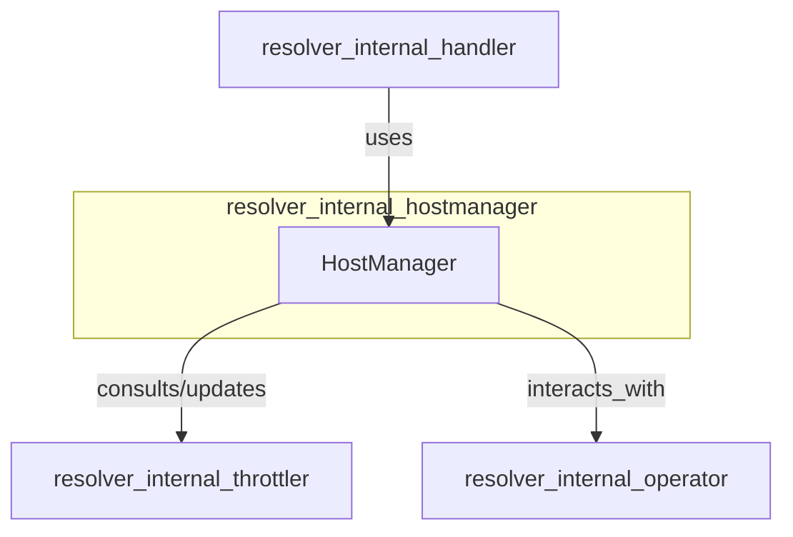

# resolver_internal_hostmanager Module Documentation

## Introduction

The `resolver_internal_hostmanager` module is a core component within the `resolver` system, primarily responsible for managing the lifecycle and state of hosts that the resolver interacts with. It maintains an up-to-date view of available and healthy hosts, enabling the resolver to make informed routing and traffic management decisions.

## Core Functionality

The central component of this module is `resolver.internal.hostmanager.hostManager.HostManager`. This structure is designed to provide robust and concurrent host management capabilities:

*   **Host Tracking**: Utilizes a `sync.Map` (`hosts`) to store and manage host-related information efficiently, allowing for concurrent access and modification across different goroutines.
*   **Logging**: Integrates with a `zap.Logger` to provide detailed logging of host management events, crucial for monitoring and debugging.
*   **Traffic Re-enablement**: Manages the duration (`trafficReEnableDuration`) after which traffic can be re-enabled to a host, likely after it has been temporarily marked unhealthy or taken out of rotation.
*   **Host Identification**: Uses a configurable `headerForHost` string, which is likely used to identify specific hosts in incoming requests or for internal routing logic.

## Architecture and Component Relationships

The `resolver_internal_hostmanager` module acts as a vital internal service for the broader `resolver` system. Its `HostManager` component is integral to how the resolver dispatches requests and manages backend health.

*   **`HostManager` (HM)**: The core of this module, responsible for maintaining the state and availability of hosts.
*   **`resolver_internal_handler`**: This module likely leverages the `HostManager` to select appropriate hosts for incoming requests based on their current status and other metrics. The `handler` module would be the primary consumer of the services offered by `resolver_internal_hostmanager`.
*   **`resolver_internal_throttler`**: The `HostManager` might consult or update the `throttler` module to apply traffic shaping, circuit breaking, or rate limiting policies based on host health or system-wide load. For instance, if a host becomes unhealthy, the `HostManager` might inform the throttler to reduce traffic to it.
*   **`resolver_internal_operator`**: This module (specifically its `RPCClient`) could be used by the `HostManager` to interact with an external or internal operator. This interaction might involve fetching host configurations, registering host status updates, or receiving commands related to host management.

## How the Module Fits into the Overall System

The `resolver_internal_hostmanager` module is critical for the `resolver`'s ability to function as an intelligent traffic router. By centralizing host state management, it ensures that the `resolver` only directs traffic to healthy and available hosts, contributing to the overall reliability and performance of the system.

It acts as an internal data source and control plane for host information, enabling other `resolver` components, particularly the `resolver_internal_handler`, to make real-time decisions about where to route requests. Its integration with throttling mechanisms allows for dynamic traffic adjustments in response to changing host conditions, and its potential interaction with an operator facilitates centralized control and configuration of the host pool.