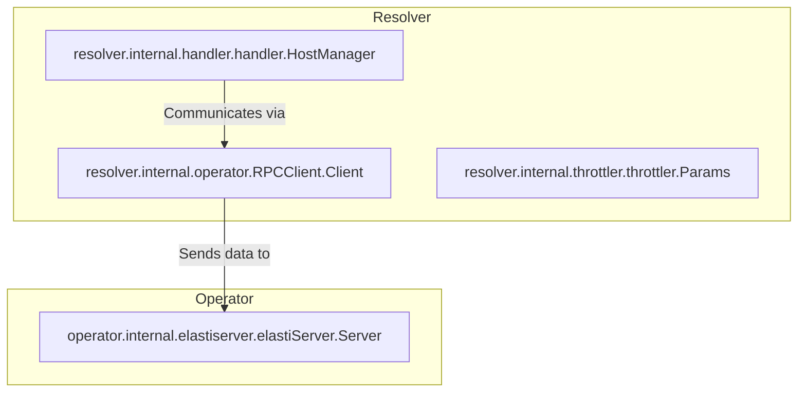

# resolver_internal_operator Module Documentation

## Introduction

The `resolver_internal_operator` module provides the client-side logic for the resolver to communicate with the `operator`. Its primary function is to enable the `resolver` to send critical information, such as incoming request details, to the `operator` to facilitate dynamic scaling and resource management within the system.

## Core Functionality

The core component of this module is `RPCClient.Client`. This component acts as an HTTP client responsible for establishing and maintaining communication channels with the `operator`. It is designed to reliably transmit data, handle retries, and manage concurrency for different services that the resolver is managing.

### `resolver.internal.operator.RPCClient.Client`

```go
type Client struct {
	logger *zap.Logger
	// retryDuration is the duration to wait before retrying the operator
	retryDuration time.Duration
	// serviceRPCLocks is to keep track of the locks for different services
	serviceRPCLocks sync.Map
	// operatorURL is the URL of the operator
	operatorURL string
	// incomingRequestEndpoint is the endpoint to send information about the incoming request
	incomingRequestEndpoint string
	// client is the http client
	client http.Client
}
```

**Fields:**

*   `logger`: An instance of `zap.Logger` for structured logging. For more details on logging, refer to [pkg_logger.md](pkg_logger.md).
*   `retryDuration`: Specifies the duration to wait before retrying a failed request to the operator, ensuring resilience in communication.
*   `serviceRPCLocks`: A `sync.Map` used to manage concurrent access and synchronize RPC calls across different services, preventing race conditions.
*   `operatorURL`: The base URL of the operator service. This is the primary endpoint for communication with the `operator`. For more information on the operator's server-side implementation, see [operator_internal_elastiserver.md](operator_internal_elastiserver.md).
*   `incomingRequestEndpoint`: A specific endpoint within the operator to which information about incoming requests is dispatched, allowing the operator to gather real-time load data.
*   `client`: The underlying standard `http.Client` instance used for making HTTP requests to the operator.

## Architecture and Component Relationships

The `resolver_internal_operator` module, specifically its `RPCClient.Client` component, serves as a bridge between the `resolver`'s internal logic and the `operator`'s scaling mechanisms. It receives information from other `resolver` components, such as the `HostManager`, and forwards it to the `operator`.



*   **`Handler_HostManager`**: The `HostManager` (defined in [resolver_internal_handler.md](resolver_internal_handler.md)) manages the hosts and their states. It interacts with the `RPCClient.Client` to report host-related metrics or request information to the `operator`.
*   **`Throttler_Params`**: Parameters from the throttler (defined in [resolver_internal_throttler.md](resolver_internal_throttler.md)) might influence how and when the `RPCClient` communicates with the operator, for example, by providing insights into current load or request queues.
*   **`ElastiServer_Server`**: This component from the `operator` module (defined in [operator_internal_elastiserver.md](operator_internal_elastiserver.md)) is the server-side endpoint that receives and processes the information sent by the `RPCClient.Client`.

## How it fits into the Overall System

The `resolver_internal_operator` module is a crucial link in the dynamic scaling architecture of the entire system. The `resolver` is responsible for routing and managing incoming requests efficiently. When requests arrive and are processed, the `RPCClient` in this module sends relevant metrics, such as incoming request counts and service status updates, to the `operator`.

The `operator`, in turn, uses this real-time information to make informed and proactive decisions about scaling services up or down based on predefined policies and current load. This ensures optimal resource utilization, maintains service performance under varying loads, and contributes significantly to the system's elasticity and resilience. Without this communication channel, the resolver would not be able to dynamically influence the scaling behavior of the underlying services managed by the operator.