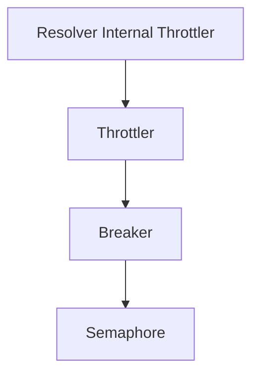

# Resolver Internal Throttler Module

## Introduction
The `resolver_internal_throttler` module is responsible for managing request concurrency and preventing system overload within the resolver component. It implements throttling and circuit breaking mechanisms to ensure the stability and reliability of services by limiting the number of in-flight requests and gracefully handling overloaded backend services.

## Architecture Overview

The `resolver_internal_throttler` module is composed of several key components that work together to provide robust throttling capabilities. The `Throttler` acts as the orchestrator, utilizing the `Breaker` for circuit breaking logic, which in turn uses a `semaphore` for fine-grained concurrency control.



## Core Components and Functionality

### Throttler Component

The `Throttler` component is the central piece of the `resolver_internal_throttler` module. It coordinates the overall throttling strategy, interacting with the circuit breaker and Kubernetes utilities to manage service readiness and request queues.

#### `resolver.internal.throttler.throttler.Throttler`
```go
type Throttler struct {
    logger                  *zap.Logger
    breaker                 *Breaker
    k8sUtil                 *k8shelper.Ops
    retryDuration           time.Duration
    TrafficReEnableDuration time.Duration
    serviceReadyMap         sync.Map
    queueSizeMap            sync.Map
}
```
**Responsibilities**:
*   Orchestrates the throttling process for incoming requests.
*   Utilizes a `Breaker` instance to apply circuit breaking logic.
*   Interacts with `k8shelper.Ops` for Kubernetes-related operations, potentially to determine service health or scale.
*   Manages retry durations and traffic re-enablement periods.
*   Keeps track of service readiness and queue sizes using `sync.Map`.

#### `resolver.internal.throttler.throttler.Params`
```go
type Params struct {
    QueueRetryDuration      time.Duration
    TrafficReEnableDuration time.Duration
    K8sUtil                 *k8shelper.Ops
    QueueDepth              int
    MaxConcurrency          int
    InitialCapacity         int
    Logger                  *zap.Logger
}
```
**Responsibilities**:
*   Defines the configuration parameters required to initialize a `Throttler` instance. These parameters include durations for retries and traffic re-enablement, Kubernetes utilities, queue depth, maximum concurrency, initial capacity for the breaker, and a logger.

### Breaker Component

The `Breaker` component implements the circuit breaker pattern, which is crucial for preventing a single failing service from cascading failures throughout the system. It controls the flow of requests based on the health of the target service.

#### `resolver.internal.throttler.breaker.Breaker`
```go
type Breaker struct {
    logger         *zap.Logger
    inFlight       atomic.Int64
    totalSlots     int64
    maxConcurrency uint16
    sem            *semaphore
}
```
**Responsibilities**:
*   Monitors the number of in-flight requests (`inFlight`).
*   Limits the maximum allowed concurrent requests (`maxConcurrency`) using a `semaphore`.
*   Acts as a gatekeeper, allowing or denying requests based on internal state and concurrency limits.
*   Provides circuit breaking logic to open the circuit when a service is unhealthy and close it when it recovers.

#### `resolver.internal.throttler.breaker.BreakerParams`
```go
type BreakerParams struct {
    QueueDepth      int
    MaxConcurrency  int
    InitialCapacity int
    Logger          *zap.Logger
}
```
**Responsibilities**:
*   Specifies the configuration parameters for initializing a `Breaker` instance, including queue depth, maximum concurrency, initial capacity, and a logger.

### Semaphore Component

The `semaphore` component provides a basic concurrency control mechanism, acting as a counting semaphore. It is used by the `Breaker` to limit the number of concurrent operations.

#### `resolver.internal.throttler.semaphore.semaphore`
```go
type semaphore struct {
    state atomic.Uint64
    queue chan struct{}
}
```
**Responsibilities**:
*   Manages access to a shared resource by maintaining a count of available permits.
*   Allows requests to proceed only if permits are available.
*   Blocks requests when no permits are available, effectively limiting concurrency.

## Relationships to Other Modules

The `resolver_internal_throttler` module plays a critical role in the overall `resolver` system by ensuring stable operation under varying load conditions. It interacts with:

*   **`pkg.k8shelper.ops.Ops`**: The `Throttler` component utilizes `k8shelper.Ops` for Kubernetes-related operations, likely to get information about the health and status of services managed by Kubernetes. For more details, refer to the [k8shelper module documentation](k8shelper.md).
*   **`pkg.config.config.Config` and `pkg.config.config.ResolverConfig`**: The `Throttler` and `Breaker` parameters are likely configured via the `pkg.config` module, which provides global and resolver-specific configuration settings. For more details, refer to the [config module documentation](config.md).
*   **`pkg.logger.logger.CustomCore`**: Both `Throttler` and `Breaker` components use `zap.Logger` for logging, which is configured via `pkg.logger`. For more details, refer to the [logger module documentation](logger.md).
