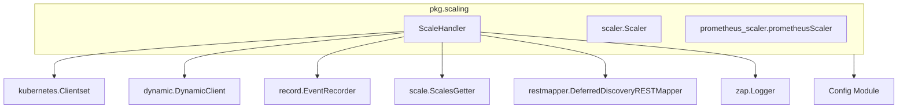

# Scale Handler Module Documentation

## Introduction
The `scale_handler` module, located within `pkg/scaling`, provides the core logic for managing scaling operations within the system. It acts as a central orchestrator for interacting with Kubernetes resources to achieve desired scaling targets.

## Purpose and Core Functionality
The primary purpose of the `ScaleHandler` is to interface with the Kubernetes API to perform scaling actions on various resources. It encapsulates the necessary clients and logic to:
*   Interact with Kubernetes API using both static (`kubernetes.Clientset`) and dynamic (`dynamic.DynamicClient`) clients.
*   Record events related to scaling operations using `record.EventRecorder`.
*   Manage concurrent scaling requests through `sync.Map` for `scaleLocks`.
*   Utilize `scale.ScalesGetter` to get and update scale subresources of Kubernetes objects.
*   Employ `restmapper.DeferredDiscoveryRESTMapper` to resolve GroupVersionKind (GVK) to GroupVersionResource (GVR) and vice-versa, allowing it to work with various Kubernetes resource types.
*   Provide logging capabilities using `zap.Logger` and operate within a specified `watchNamespace`.

The `ScaleHandler` is a critical component for any scaling decision made by the system, translating abstract scaling requirements into concrete Kubernetes API calls.

## Architecture and Component Relationships

The `ScaleHandler` is a central component in the `pkg.scaling` package. It relies on various Kubernetes clients and utilities to perform its functions.

### Component Breakdown:

*   **`ScaleHandler`**: The main struct in this module, responsible for orchestrating scaling operations.
*   **`kubernetes.Clientset`**: A standard Kubernetes client for interacting with strongly-typed Kubernetes API objects.
*   **`dynamic.DynamicClient`**: A client for interacting with arbitrary Kubernetes API objects without knowing their types at compile time. This is crucial for handling custom resources or resources whose types are not known beforehand.
*   **`record.EventRecorder`**: Used to record events in Kubernetes, which can be useful for debugging and auditing scaling operations.
*   **`scale.ScalesGetter`**: An interface for getting and updating the scale subresource of a Kubernetes object. This allows direct manipulation of a resource's replica count.
*   **`restmapper.DeferredDiscoveryRESTMapper`**: Helps in mapping Kubernetes GroupVersionKind (GVK) to GroupVersionResource (GVR) which is essential for dynamic client operations and for working with custom resources.
*   **`zap.Logger`**: Provides efficient structured logging.

### Relationships with other modules:

*   **`scalers` module (`scalers.md`)**: The `ScaleHandler` likely works in conjunction with various `Scaler` implementations (e.g., `prometheus_scaler.prometheusScaler`) defined in the `scalers` module. These scalers would determine *when* and *how much* to scale, and then delegate the actual scaling execution to the `ScaleHandler`.
*   **`config` module (`config.md`)**: Configuration settings, such as `watchNamespace`, are likely provided by the `pkg.config.config.Config` or `pkg.config.config.ResolverConfig` from the `config` module.

## How the module fits into the overall system

The `scale_handler` module is a fundamental part of the system's auto-scaling capabilities. It acts as the execution layer for scaling decisions. When an autoscaler (potentially implemented using components from the `scalers` module) determines that a resource needs to be scaled up or down, it will use the `ScaleHandler` to communicate with the Kubernetes API and apply the desired replica changes. This separation of concerns allows different scaling policies and metrics to be implemented by various `Scaler` components, while `ScaleHandler` provides a consistent and robust mechanism for interacting with the underlying infrastructure.
