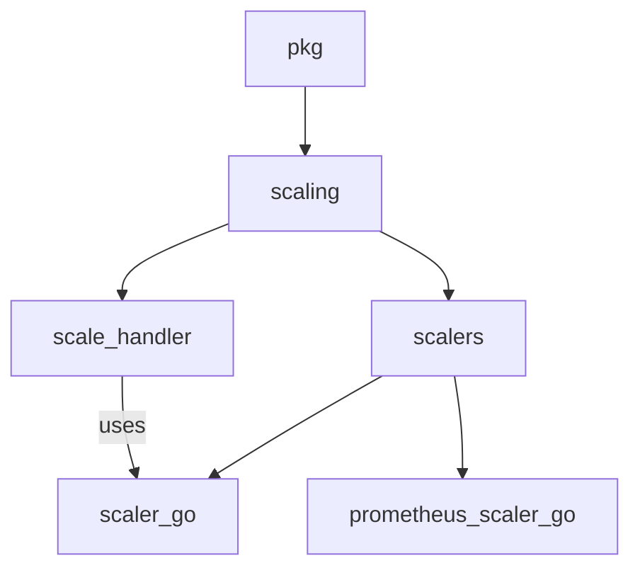

# scaler_go Module Documentation

## Introduction
The `scaler_go` module defines the core `Scaler` interface, providing a contract for different scaling implementations within the system. This module is fundamental for abstracting the scaling logic, allowing for various types of scalers (e.g., Prometheus-based) to be integrated seamlessly.

## Core Functionality
The primary component of this module is the `Scaler` interface. This interface outlines the essential methods that any concrete scaler implementation must provide, enabling the system to manage the scaling of services based on various metrics and conditions.

### `pkg.scaling.scalers.scaler.Scaler`
```go
type Scaler interface {
	IsHealthy(ctx context.Context) (bool, error)
	ShouldScaleToZero(ctx context.Context) (bool, error)
	ShouldScaleFromZero(ctx context.Context) (bool, error)
	Close(ctx context.Context) error
}
```
The `Scaler` interface defines the following methods:
- `IsHealthy(ctx context.Context) (bool, error)`: Checks the health status of the scaler.
- `ShouldScaleToZero(ctx context.Context) (bool, error)`: Determines if the service should be scaled down to zero instances.
- `ShouldScaleFromZero(ctx context.Context) (bool, error)`: Determines if the service should be scaled up from zero instances.
- `Close(ctx context.Context) error`: Cleans up any resources held by the scaler.

## Architecture and Component Relationships

The `scaler_go` module, with its `Scaler` interface, serves as a crucial abstraction layer within the `scaling` package. It defines the contract for how different scaling mechanisms should operate, allowing for extensibility and modularity. Concrete implementations, such as those found in `prometheus_scaler_go`, adhere to this interface. The `scale_handler` module utilizes this interface to manage scaling operations, orchestrating the actions of various scalers.



## How the Module Fits into the Overall System
The `scaler_go` module provides the fundamental interface for all scaling operations in the system. By defining a common `Scaler` interface, it ensures that different scaling strategies (e.g., reactive scaling based on Prometheus metrics, proactive scaling based on custom logic) can be seamlessly integrated and managed by the `scale_handler`. This promotes a pluggable architecture for scaling, allowing new scaler types to be added without modifying core scaling logic.

## References
- For more details on the scaling orchestrator, refer to the [scale_handler module documentation](scale_handler.md).
- For a concrete implementation of the `Scaler` interface, see the [prometheus_scaler_go module documentation](prometheus_scaler_go.md).
- For the parent module, refer to the [scaling module documentation](scaling.md).