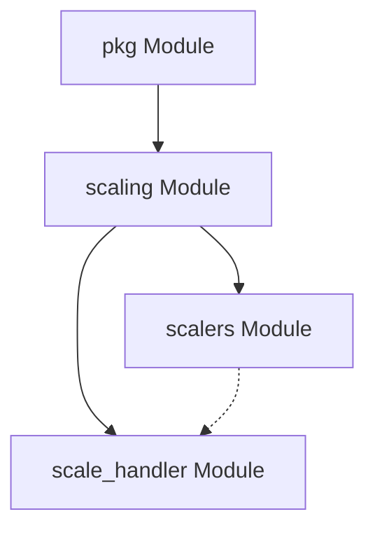

# Scalers Module Documentation

## Introduction

The `scalers` module, part of the `pkg.scaling` package, defines the interfaces and concrete implementations for various scaling mechanisms within the system. It provides the foundational elements for determining when and how to scale resources, integrating with external monitoring systems like Prometheus.

## Architecture Overview

The `scalers` module integrates with the `scale_handler` module to provide a flexible and extensible scaling solution. It defines a generic `Scaler` interface, allowing for different scaling strategies to be implemented and utilized. The `prometheus_scaler` is a concrete implementation that leverages Prometheus metrics for scaling decisions.



## Core Components

This section details the core components within the `scalers` module.

### Scaler Interface

`pkg.scaling.scalers.scaler.Scaler`

This interface defines the contract for any scaling mechanism. Implementations of this interface are responsible for determining the health of a service and making decisions about scaling up or down, including scaling to and from zero instances.

```go
type Scaler interface {
        IsHealthy(ctx context.Context) (bool, error)
        ShouldScaleToZero(ctx context.Context) (bool, error)
        ShouldScaleFromZero(ctx context.Context) (bool, error)
        Close(ctx context.Context) error
}
```

**Responsibilities:**
*   **`IsHealthy`**: Checks the current health status of the service managed by the scaler.
*   **`ShouldScaleToZero`**: Determines if the service should be scaled down to zero instances, typically when there's no traffic or demand.
*   **`ShouldScaleFromZero`**: Determines if the service should be scaled up from zero instances, typically when demand requires resources.
*   **`Close`**: Handles any cleanup or resource release when the scaler is no longer needed.

### Prometheus Metadata

`pkg.scaling.scalers.prometheus_scaler.prometheusMetadata`

This structure defines the configuration parameters required for the Prometheus scaler. It specifies how to connect to a Prometheus server, the query to execute, and the threshold for scaling decisions.

```go
type prometheusMetadata struct {
        ServerAddress string            `json:"serverAddress"`
        Query         string            `json:"query"`  Threshold     float64           `json:"threshold,string"`
        UptimeFilter  string            `json:"uptimeFilter"`
        Headers       map[string]string `json:"headers"`
}
```

**Fields:**
*   **`ServerAddress`**: The address of the Prometheus server.
*   **`Query`**: The PromQL query to execute for metric retrieval.
*   **`Threshold`**: The value that the query result is compared against to make scaling decisions.
*   **`UptimeFilter`**: An optional filter for uptime metrics.
*   **`Headers`**: Custom HTTP headers to be sent with Prometheus requests.

### Prometheus Scaler

`pkg.scaling.scalers.prometheus_scaler.prometheusScaler`

This is a concrete implementation of the `Scaler` interface that uses Prometheus metrics to drive scaling decisions. It utilizes the `prometheusMetadata` for its configuration and interacts with a Prometheus server to gather relevant data.

```go
type prometheusScaler struct {
        httpClient           *http.Client
        metadata             *prometheusMetadata
        cooldownPeriod       time.Duration
        defaultServerAddress string
        defaultHeaders       map[string]string
}
```

**Responsibilities:**
*   Implements the `Scaler` interface using Prometheus metrics.
*   Manages HTTP communication with the Prometheus server.
*   Applies a cooldown period to prevent rapid, successive scaling actions.
*   Uses `prometheusMetadata` to configure its operation, including the query and threshold.

