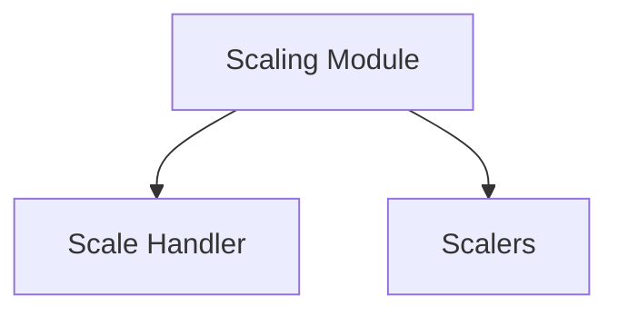

# Scaling Module

## Introduction

The `scaling` module is responsible for managing the scaling operations within the system. It provides mechanisms to handle scale-in and scale-out events for various services, integrating with Kubernetes for resource management and external monitoring systems like Prometheus for metric-driven scaling decisions.

## Architecture

The `scaling` module is composed of a `ScaleHandler` which orchestrates the scaling process, and various `Scalers` that define the logic for different scaling strategies.

## Sub-modules and Core Components

### Scale Handler (`scale_handler.md`)
The `ScaleHandler` component is the central orchestrator for scaling operations. It interacts with the Kubernetes API to adjust resource replicas and manages concurrency for scaling events.

### Scalers (`scalers.md`)
The `Scalers` sub-module defines the interfaces and implementations for different scaling mechanisms, such as Prometheus-based scaling.

## Dependencies
The `scaling` module relies on the [config](../pkg/config/config.md) module for configuration parameters.
