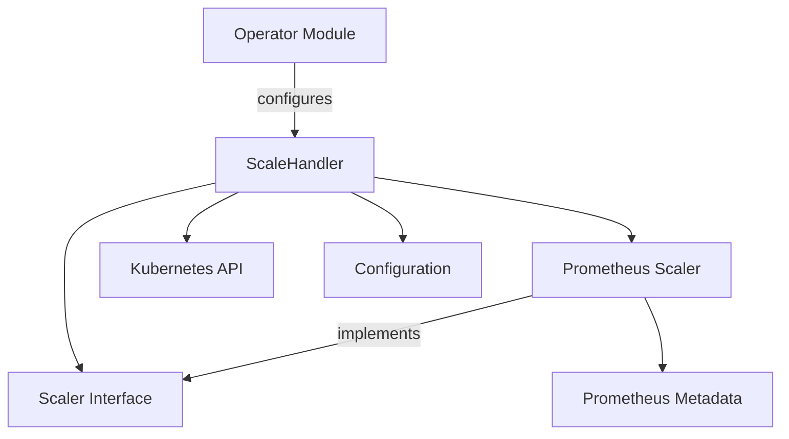

# Scaling Module Documentation

## Introduction

The `scaling` module is a critical component within the system responsible for dynamically adjusting the resources allocated to services based on predefined metrics and policies. It provides the core logic for both scaling up (adding more resources) and scaling down (releasing resources), ensuring optimal resource utilization and service performance. This module abstracts various scaling mechanisms through a common interface, allowing for extensibility with different metrics sources and scaling strategies.

## Core Functionality and Components

The `scaling` module comprises several key components that work together to achieve its functionality:

### 1. `Scaler` Interface (`pkg.scaling.scalers.scaler.Scaler`)

The `Scaler` interface defines the contract that all scaling implementations must adhere to. This provides a pluggable architecture for integrating different types of metric sources and scaling logic.

```go
type Scaler interface {
	IsHealthy(ctx context.Context) (bool, error)
	ShouldScaleToZero(ctx context.Context) (bool, error)
	ShouldScaleFromZero(ctx context.Context) (bool, error)
	Close(ctx context.Context) error
}
```

*   **`IsHealthy(ctx context.Context) (bool, error)`**: Checks the health status of the scaler or the service it monitors.
*   **`ShouldScaleToZero(ctx context.Context) (bool, error)`**: Determines if the service should be scaled down to zero instances.
*   **`ShouldScaleFromZero(ctx context.Context) (bool, error)`**: Determines if the service should be scaled up from zero instances.
*   **`Close(ctx context.Context) error`**: Performs any necessary cleanup when the scaler is no longer needed.

### 2. `ScaleHandler` (`pkg.scaling.scale_handler.ScaleHandler`)

The `ScaleHandler` is the central orchestrator of the scaling process. It manages the lifecycle of scaling operations, interacts with the Kubernetes API to apply scaling changes, and handles concurrency.

```go
type ScaleHandler struct {
	kClient        *kubernetes.Clientset
	kDynamicClient *dynamic.DynamicClient
	EventRecorder  record.EventRecorder

	scaleLocks sync.Map

	scaleClient scale.ScalesGetter
	restMapper  *restmapper.DeferredDiscoveryRESTMapper

	logger         *zap.Logger
	watchNamespace string
}
```

*   **`kClient`, `kDynamicClient`, `scaleClient`**: Kubernetes clients used to interact with the Kubernetes API for managing resources like Deployments, StatefulSets, and custom resources.
*   **`EventRecorder`**: Records Kubernetes events for auditing and debugging.
*   **`scaleLocks`**: A `sync.Map` used to prevent race conditions during concurrent scaling operations.
*   **`restMapper`**: Helps discover Kubernetes API resources and their corresponding GVKs (Group, Version, Kind).
*   **`logger`**: An instance of a Zap logger for logging scaling-related events and errors.
*   **`watchNamespace`**: The Kubernetes namespace that the `ScaleHandler` is configured to monitor.

The `ScaleHandler` is responsible for receiving scaling requests, consulting the appropriate `Scaler` implementation, and then applying the desired scale to the target Kubernetes resource. It likely leverages the [k8shelper module](k8shelper.md) for its Kubernetes operations.

### 3. `Prometheus Scaler` (`pkg.scaling.scalers.prometheus_scaler.prometheusScaler`)

The `prometheusScaler` is a concrete implementation of the `Scaler` interface that uses Prometheus as a metric source to make scaling decisions.

```go
type prometheusScaler struct {
	httpClient           *http.Client
	metadata             *prometheusMetadata
	cooldownPeriod       time.Duration
	defaultServerAddress string
	defaultHeaders       map[string]string
}
```

*   **`httpClient`**: An HTTP client to query the Prometheus server.
*   **`metadata`**: Contains configuration details specific to the Prometheus query.
*   **`cooldownPeriod`**: A duration to prevent rapid, successive scaling actions.
*   **`defaultServerAddress`**: The default address of the Prometheus server.
*   **`defaultHeaders`**: Default HTTP headers to include in Prometheus API requests.

### 4. `Prometheus Metadata` (`pkg.scaling.scalers.prometheus_scaler.prometheusMetadata`)

This struct holds the configuration required for the `prometheusScaler` to interact with a Prometheus instance and interpret its metrics.

```go
type prometheusMetadata struct {
	ServerAddress string            `json:"serverAddress"`
	Query         string            `json:"query"`
	Threshold     float64           `json:"threshold,string"`
	UptimeFilter  string            `json:"uptimeFilter"`
	Headers       map[string]string `json:"headers"`
}
```

*   **`ServerAddress`**: The URL of the Prometheus server.
*   **`Query`**: The PromQL query to execute against Prometheus to retrieve metrics.
*   **`Threshold`**: The value that the query result is compared against to determine scaling actions.
*   **`UptimeFilter`**: A filter used in the Prometheus query to consider only healthy/up instances.
*   **`Headers`**: Custom HTTP headers to be sent with the Prometheus query.

## Architecture and Component Relationships

The following diagram illustrates the high-level architecture of the `scaling` module and its interactions with other system components:



*   The **`ScaleHandler`** acts as the central coordinator, receiving scaling instructions and interacting with the Kubernetes API to effect changes.
*   It utilizes implementations of the **`Scaler Interface`** (e.g., **`Prometheus Scaler`**) to determine if scaling actions are required based on external metrics.
*   The **`Prometheus Scaler`** uses **`Prometheus Metadata`** to configure its interaction with a Prometheus server.
*   The **`Operator Module`** is responsible for defining and managing the `ElastiService` custom resources, which contain the scaling policies and configurations that drive the `ScaleHandler`.
*   The **`Configuration`** module ([config.md](config.md)) provides global system settings that the `ScaleHandler` and other components might consume.
*   The **`Kubernetes API`** is the target of all scaling operations, with the `ScaleHandler` directly interacting with it, potentially via helper functions in the [k8shelper module](k8shelper.md).

## How the Module Fits into the Overall System

The `scaling` module is an integral part of the `pkg` module, providing the dynamic resource management capabilities essential for maintaining service performance and efficiency.

*   **Integration with Operator**: The `operator` module defines `ElastiService` custom resources, including `AutoscalerSpec`, which specifies the scaling triggers and policies. The `ScaleHandler` in the `scaling` module processes these specifications to determine and execute scaling actions.
*   **Kubernetes Interaction**: It heavily relies on Kubernetes APIs (potentially via the `pkg.k8shelper` module) to monitor target resources, retrieve their current scale, and apply desired scale modifications.
*   **Configuration**: It consumes system-wide and module-specific configurations provided by the `pkg.config` module to initialize clients, set default parameters, and define operational behaviors.
*   **Metrics Integration**: By implementing the `Scaler` interface, the module can integrate with various metrics providers (like Prometheus), making it flexible and adaptable to different monitoring setups.
*   **Impact on Resolver**: Decisions made by the `scaling` module, such as scaling up or down, directly influence the number of available instances for a service. The `resolver` module, which is responsible for routing requests, would need to be aware of these changes to effectively distribute traffic across the scaled instances, potentially interacting with components like `resolver.internal.hostmanager.hostManager.HostManager`.
*   **Message Processing**: It may process messages related to host status (`pkg.messages.host.Host`) or request counts (`pkg.messages.operator.RequestCount`) to inform its scaling decisions, though this is implied rather than directly shown in the provided core components.
