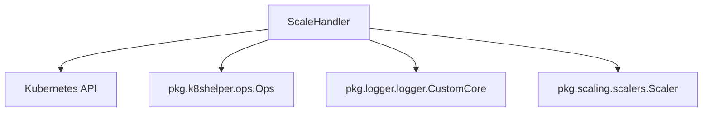

The `scaling_scale_handler` module plays a crucial role in managing the scaling operations within the system. It provides the core `ScaleHandler` component responsible for orchestrating interactions with the Kubernetes API to adjust the scale of various resources based on defined triggers and metrics.

### Core Functionality

The `ScaleHandler` component is designed to manage the lifecycle of scaling operations for Kubernetes resources. Its primary responsibilities include:

*   **Kubernetes API Interaction**: Directly interacts with the Kubernetes API using `kubernetes.Clientset` and `dynamic.DynamicClient` for general resource management and dynamic access to custom resources.
*   **Scale Subresource Management**: Utilizes `scale.ScalesGetter` to get and update the `scale` subresource of scalable Kubernetes objects, enabling efficient scaling adjustments.
*   **Resource Mapping**: Employs `restmapper.DeferredDiscoveryRESTMapper` to resolve GroupVersionKind (GVK) to GroupVersionResource (GVR), which is essential for working with dynamic Kubernetes resources.
*   **Event Recording**: Records Kubernetes events via `record.EventRecorder` to provide visibility into scaling actions and potential issues.
*   **Concurrency Control**: Uses `sync.Map` (`scaleLocks`) to manage concurrent scaling requests and prevent race conditions or conflicting updates to resource scales.
*   **Logging**: Integrates with a logging mechanism (`*zap.Logger`) for comprehensive operational insights and debugging.
*   **Namespace Specificity**: Operates within a specified `watchNamespace`, focusing its scaling activities to a particular scope within the Kubernetes cluster.

### Architecture

The `ScaleHandler` module serves as an intermediary between the core scaling logic and the Kubernetes API. It leverages various Kubernetes client functionalities and integrates with internal utilities for logging and Kubernetes operations.

*   **Kubernetes API**: The `ScaleHandler` directly communicates with the Kubernetes API server for all resource-related operations, including getting resource states and updating their scale.
*   **`pkg.k8shelper.ops.Ops`**: This module likely provides higher-level abstractions or utility functions for interacting with Kubernetes clients, simplifying the `ScaleHandler`'s interactions with the cluster.
*   **`pkg.logger.logger.CustomCore`**: The `ScaleHandler` uses the custom logger for all its logging needs, ensuring consistent and structured logging across the application.
*   **`pkg.scaling.scalers.Scaler`**: While `ScaleHandler` itself orchestrates the scaling, it works in conjunction with concrete `Scaler` implementations (e.g., `prometheusScaler`) from the `scaling_scalers` module to determine *how* to scale based on specific metrics and triggers.

### How it Fits into the Overall System

The `scaling_scale_handler` module is a critical component within the `pkg` (package) layer, specifically residing within the `scaling` sub-package. It acts as the operational core for executing scaling decisions made by other parts of the system, such as those initiated by the `operator` module based on `ElastiService` definitions.

When the `operator.internal.controller.elastiservice_controller.ElastiServiceReconciler` detects a need for scaling (e.g., due to a `ScaleTrigger` in an `ElastiServiceSpec`), it would interact with the `ScaleHandler` to perform the actual scale operation on the target resource (`ScaleTargetRef`).

The `ScaleHandler` ensures that scaling actions are performed safely, efficiently, and with proper logging and event recording, contributing to the overall stability and observability of the autoscaling system. It relies on configuration provided by `pkg.config.config.Config` and potentially interacts with message types defined in `pkg.messages` for internal communication regarding scaling requests or host information.

This module is essential for bridging the declarative state defined by Custom Resources (like `ElastiService`) and the imperative actions required to modify the underlying Kubernetes infrastructure.
