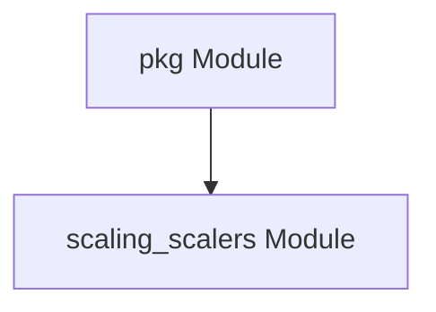

# `scaling_scalers` Module Documentation

## Introduction

The `scaling_scalers` module is a core component within the `pkg` package responsible for defining and implementing various scaling mechanisms for services. It provides a standardized interface for different scaler types and includes a concrete implementation for Prometheus-based scaling. This module plays a crucial role in enabling dynamic adjustment of resources based on predefined metrics and conditions.

## Architecture

The `scaling_scalers` module primarily defines the `Scaler` interface, which all specific scaler implementations must adhere to. The `prometheusScaler` is one such implementation, leveraging Prometheus metrics for scaling decisions.



## Core Components

### `Scaler` Interface

The `Scaler` interface (`pkg.scaling.scalers.scaler.Scaler`) defines the contract that all scaling implementations must satisfy. It provides a set of methods to determine the health of a service, decide whether to scale to zero or from zero instances, and handle resource closure.

```go
type Scaler interface {
	IsHealthy(ctx context.Context) (bool, error)
	ShouldScaleToZero(ctx context.Context) (bool, error)
	ShouldScaleFromZero(ctx context.Context) (bool, error)
	Close(ctx context.Context) error
}
```

**Responsibilities:**
*   **`IsHealthy`**: Checks the current health status of the service being scaled.
*   **`ShouldScaleToZero`**: Determines if the service should be scaled down to zero instances, typically based on inactivity or low demand.
*   **`ShouldScaleFromZero`**: Determines if the service should be scaled up from zero instances, typically based on new requests or increased demand.
*   **`Close`**: Handles any necessary cleanup or resource release when the scaler is no longer needed.

### `prometheusScaler`

The `prometheusScaler` (`pkg.scaling.scalers.prometheus_scaler.prometheusScaler`) is an implementation of the `Scaler` interface that utilizes Prometheus metrics for making scaling decisions.

```go
type prometheusScaler struct {
	httpClient           *http.Client
	metadata             *prometheusMetadata
	cooldownPeriod       time.Duration
	defaultServerAddress string
	defaultHeaders       map[string]string
}
```

**Responsibilities:**
*   Interacts with a Prometheus server to query metrics.
*   Uses `prometheusMetadata` to configure the specific Prometheus query and scaling threshold.
*   Manages an HTTP client for Prometheus API communication.
*   Applies a cooldown period to prevent rapid, successive scaling actions.
*   Provides default server address and headers for Prometheus communication.

### `prometheusMetadata`

The `prometheusMetadata` (`pkg.scaling.scalers.prometheus_scaler.prometheusMetadata`) struct defines the configuration required for a `prometheusScaler` to operate.

```go
type prometheusMetadata struct {
	ServerAddress string            `json:"serverAddress"`
	Query         string            `json:"query"`
	Threshold     float64           `json:"threshold,string"`
	UptimeFilter  string            `json:"uptimeFilter"`
	Headers       map[string]string `json:"headers"`
}
```

**Fields:**
*   **`ServerAddress`**: The URL of the Prometheus server.
*   **`Query`**: The PromQL query to execute against Prometheus to retrieve metrics relevant for scaling decisions.
*   **`Threshold`**: A numerical threshold that, when crossed by the query result, triggers a scaling action.
*   **`UptimeFilter`**: An optional filter applied to metrics to consider only instances that have been running for a certain duration.
*   **`Headers`**: Custom HTTP headers to be sent with Prometheus API requests.
