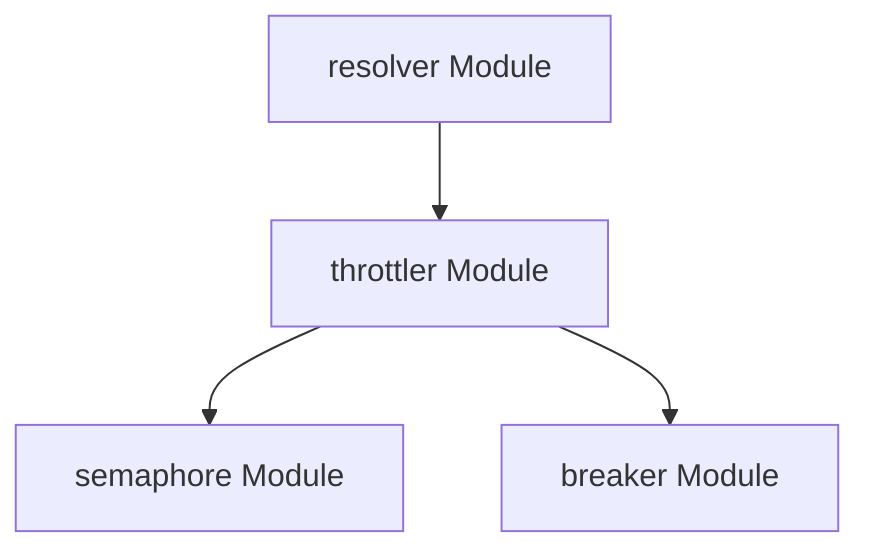

# semaphore Module Documentation

## Introduction
The `semaphore` module is a core component within the `resolver` system, specifically residing under the `throttler` package. It provides essential concurrency control mechanisms, utilizing a semaphore implementation to manage access to shared resources and regulate the flow of operations.

## Purpose and Core Functionality
The `semaphore` module implements a semaphore mechanism to limit the number of concurrent operations or resource accesses. This is crucial for preventing resource exhaustion and ensuring system stability under varying load conditions.

The core component, `resolver.internal.throttler.semaphore.semaphore`, is defined as follows:

```go
type semaphore struct {
	state atomic.Uint64
	queue chan struct{}
}
```

*   **`state atomic.Uint64`**: This field likely maintains the current count of the semaphore, indicating the number of available permits. The use of `atomic.Uint64` ensures thread-safe operations on the semaphore's state, which is critical in concurrent environments.
*   **`queue chan struct{}`**: This channel is used to queue incoming requests when the semaphore's capacity is reached. Requests wait in this queue until a permit becomes available, ensuring fair access and preventing new requests from being processed until existing ones complete or release their permits.

This design allows the `semaphore` to effectively control concurrency by allowing a fixed number of operations to proceed simultaneously, while others are temporarily halted.

## Architecture and Component Relationships

The `semaphore` module is an integral part of the `throttler` module, which itself is a sub-component of the broader `resolver` system. It works in conjunction with other throttling mechanisms, such as the `breaker` module, to provide robust flow control.



*   **`resolver` Module**: The top-level module responsible for resolving requests and managing the overall system.
*   **`throttler` Module**: This module encapsulates various flow control and stability mechanisms, including both semaphores and circuit breakers. The `semaphore` module provides a fundamental building block for the `throttler`'s concurrency management.
*   **`breaker` Module**: (Refer to [breaker.md](breaker.md) for details) This module typically implements a circuit breaker pattern to prevent cascading failures by quickly failing requests to unhealthy services. The `semaphore` and `breaker` modules collectively contribute to the `throttler`'s ability to maintain system resilience.

## How the Module Fits into the Overall System

The `semaphore` module plays a vital role within the `resolver` system by enforcing concurrency limits. In a high-traffic environment, the `resolver` needs to handle numerous requests efficiently without overwhelming its backend services or exhausting its own resources.

By integrating the `semaphore` within the `throttler`, the `resolver` can:
*   **Control Concurrency**: Limit the number of active requests to a specific service or resource, preventing overload.
*   **Resource Protection**: Safeguard critical system resources from being depleted by an excessive number of simultaneous operations.
*   **Maintain Stability**: Ensure predictable performance and prevent system degradation during peak loads or unexpected traffic spikes.
*   **Graceful Degradation**: Allow the system to continue operating stably, albeit at a reduced capacity, rather than failing entirely under extreme pressure.

In essence, the `semaphore` module provides a critical layer of protection, enabling the `resolver` to manage its workload effectively and maintain a high level of availability and responsiveness.