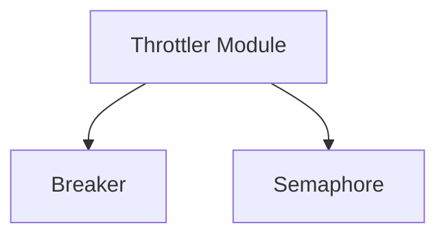

# Throttler Module

## Introduction
The `throttler` module in the `resolver` service is responsible for managing and controlling the flow of requests to prevent system overload and ensure stability. It implements concurrency limits and circuit breaking mechanisms to protect backend services from excessive load and handle service degradation gracefully.

## Architecture
The throttler module is composed of two main sub-modules: `breaker` and `semaphore`. These components work together to provide robust traffic management capabilities.

## Sub-modules Overview

### Breaker
The `breaker` sub-module implements the circuit breaker pattern. It monitors the health and performance of downstream services and, when certain thresholds are met (e.g., high error rates, slow responses), it "opens" the circuit to prevent further requests from being sent to the unhealthy service. This helps to prevent cascading failures and allows the service to recover.
For more details, refer to [breaker.md](breaker.md).

### Semaphore
The `semaphore` sub-module provides a counting semaphore implementation. It is used to control access to a shared resource by maintaining a count of available permits. Requests acquire a permit before proceeding and release it upon completion, ensuring that the number of concurrent operations does not exceed a predefined limit.
For more details, refer to [semaphore.md](semaphore.md).
