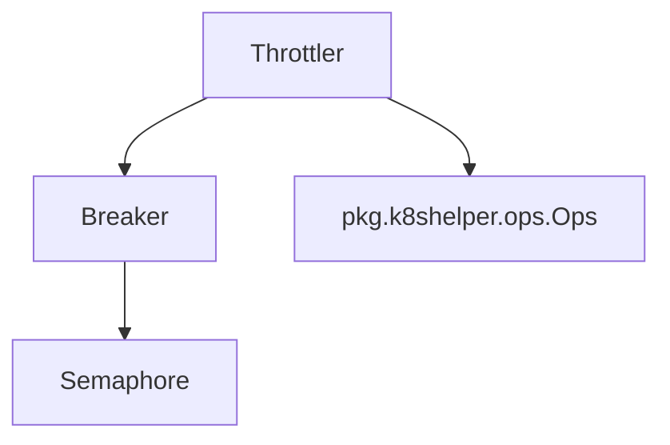

# Throttler Module Documentation

## Introduction

The `throttler` module within the `resolver` component is responsible for controlling the flow of requests, preventing system overload, and ensuring resilience. It implements concurrency limits and circuit breaking patterns to manage traffic effectively and gracefully handle backend service issues.

## Core Functionality

The `throttler` module provides mechanisms to:

*   **Limit Concurrency**: Control the maximum number of in-flight requests to a backend service.
*   **Implement Circuit Breaking**: Automatically stop sending requests to an unhealthy service and gradually re-enable it once it recovers.
*   **Manage Queues and Retries**: Handle requests that exceed concurrency limits by queuing them or retrying after a specified duration.

## Architecture and Component Relationships

The `throttler` module is composed of several key components that work together to achieve its functionality:

*   **`semaphore`**: A fundamental concurrency primitive used to limit the number of concurrent operations.
*   **`Breaker`**: Implements the circuit breaker pattern, using a `semaphore` to manage in-flight requests and detect service health.
*   **`Throttler`**: The main orchestrator that uses `Breaker` and other configurations to apply throttling logic to incoming requests.

### Components:

*   **`resolver.internal.throttler.semaphore.semaphore`**
    ```go
type semaphore struct {
	state atomic.Uint64
	queue chan struct{}
}
```
    A basic semaphore implementation used for controlling concurrent access. It maintains an atomic counter for its state and a channel for queuing. This component is a low-level primitive used by the `Breaker`.

*   **`resolver.internal.throttler.breaker.BreakerParams`**
    ```go
type BreakerParams struct {
	QueueDepth      int
	MaxConcurrency  int
	InitialCapacity int
	Logger          *zap.Logger
}
```
    Configuration parameters for the `Breaker` component, defining its behavior such as queue depth, maximum concurrency, initial capacity, and a logger.

*   **`resolver.internal.throttler.breaker.Breaker`**
    ```go
type Breaker struct {
	logger         *zap.Logger
	inFlight       atomic.Int64
	totalSlots     int64
	maxConcurrency uint16
	sem            *semaphore
}
```
    The `Breaker` struct implements the circuit breaking logic. It uses an `atomic.Int64` to track in-flight requests, has a `totalSlots` to define its capacity, and leverages a `semaphore` to manage concurrency. It works with the `Throttler` to decide when to allow or deny requests based on service health and load.

*   **`resolver.internal.throttler.throttler.Params`**
    ```go
type (
	Throttler struct {
		logger                  *zap.Logger
		breaker                 *Breaker
		k8sUtil                 *k8shelper.Ops
		retryDuration           time.Duration
		TrafficReEnableDuration time.Duration
		serviceReadyMap         sync.Map
		queueSizeMap            sync.Map
	}

	Params struct {
		QueueRetryDuration      time.Duration
		TrafficReEnableDuration time.Duration
		K8sUtil                 *k8shelper.Ops
		QueueDepth              int
		MaxConcurrency          int
		InitialCapacity         int
		Logger                  *zap.Logger
	}
)
```
    The `Throttler` struct orchestrates the overall throttling logic. It holds a reference to a `Breaker`, a `k8shelper.Ops` utility for Kubernetes interactions (likely for service readiness checks), and manages retry durations and traffic re-enablement. The `Params` struct provides configuration for initializing a `Throttler` instance.

### Architecture Diagram



## Integration with the Overall System

The `throttler` module is a critical part of the `resolver` component. It acts as a gatekeeper for requests before they are forwarded to backend services, ensuring that the `resolver` operates reliably under varying load conditions and service health. It integrates with:

*   **`handler` module**: The `handler` module (e.g., `resolver.internal.handler.handler.HostManager`) likely utilizes the `Throttler` to manage requests directed to specific hosts or services, ensuring that individual services are not overwhelmed. [handler.md](handler.md)
*   **`pkg.k8shelper.ops.Ops`**: The `Throttler` uses `k8shelper.Ops` for Kubernetes-related operations, which might include checking service readiness or obtaining service-specific information to inform its throttling decisions. [pkg.md](pkg.md)
