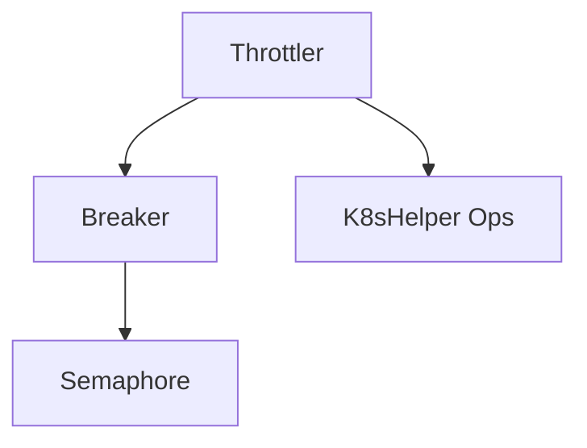

# Throttler Module Documentation

## Introduction

The `throttler` module is a critical component within the resolver system, responsible for managing and limiting the concurrency of requests to prevent system overload and ensure stability. It implements circuit breaking and semaphore-based throttling mechanisms to control the flow of traffic, protect downstream services, and handle transient failures gracefully.

## Architecture and Component Relationships

The `throttler` module comprises several key components that work together to achieve robust request throttling. The main orchestrator is the `Throttler` component, which utilizes a `Breaker` for circuit breaking logic and integrates with Kubernetes utilities for operational insights. The `Breaker`, in turn, relies on a `semaphore` for low-level concurrency control.



### Core Components

#### `Throttler`
The `Throttler` struct is the main entry point for the throttling functionality. It encapsulates the logic for managing request concurrency, integrating a circuit breaker, and interacting with Kubernetes for operational context.

**Code:**
```go
type (
	Throttler struct {
		logger                  *zap.Logger
		breaker                 *Breaker
		k8sUtil                 *k8shelper.Ops
	
etryDuration           time.Duration
		TrafficReEnableDuration time.Duration
		serviceReadyMap         sync.Map
		queueSizeMap            sync.Map
	}
    // ...
)
```

**Description:**
- `logger`: An instance of `zap.Logger` for structured logging.
- `breaker`: A pointer to a `Breaker` instance, which handles the circuit breaking logic.
- `k8sUtil`: A pointer to `k8shelper.Ops` from the `pkg` module, providing utilities for interacting with Kubernetes. This dependency allows the throttler to potentially fetch information about services or manage resources based on throttling decisions. For more details, refer to the [pkg module documentation](pkg.md).
- `retryDuration`: The duration to wait before retrying a request that was throttled or failed.
- `TrafficReEnableDuration`: The duration after which traffic might be re-enabled after a circuit break.
- `serviceReadyMap`: A `sync.Map` to keep track of the readiness status of various services.
- `queueSizeMap`: A `sync.Map` to store and manage queue sizes for different services.

#### `Params`
The `Params` struct is used to configure the `Throttler` instance.

**Code:**
```go
type (
	// ...
	Params struct {
		QueueRetryDuration      time.Duration
		TrafficReEnableDuration time.Duration
		K8sUtil                 *k8shelper.Ops
		QueueDepth              int
		MaxConcurrency          int
		InitialCapacity         int
		Logger                  *zap.Logger
	}
)
```

**Description:**
- `QueueRetryDuration`: Configures the `retryDuration` for the `Throttler`.
- `TrafficReEnableDuration`: Configures the `TrafficReEnableDuration` for the `Throttler`.
- `K8sUtil`: Provides the `k8shelper.Ops` instance for the `Throttler`. Refer to [pkg module documentation](pkg.md) for more details.
- `QueueDepth`: Specifies the depth of the queue for the underlying `Breaker`'s semaphore.
- `MaxConcurrency`: Defines the maximum number of concurrent requests allowed by the `Breaker`.
- `InitialCapacity`: Sets the initial capacity for the `Breaker`.
- `Logger`: Provides a `zap.Logger` instance for the `Throttler`.

#### `Breaker` Component
The `Breaker` struct implements the circuit breaker pattern, allowing the system to detect and prevent requests from being sent to services that are likely to fail.

**Code:**
```go
type Breaker struct {
	logger         *zap.Logger
	inFlight       atomic.Int64
	totalSlots     int64
	maxConcurrency uint16
	sem            *semaphore
}
```

**Description:**
- `logger`: An instance of `zap.Logger` for logging within the circuit breaker.
- `inFlight`: An atomic counter that tracks the number of requests currently being processed.
- `totalSlots`: The total number of available slots for concurrent requests.
- `maxConcurrency`: The maximum number of concurrent requests allowed before the breaker trips.
- `sem`: A pointer to a `semaphore` instance, used to control access to shared resources and limit concurrency.

#### `BreakerParams`
The `BreakerParams` struct is used to configure a `Breaker` instance.

**Code:**
```go
type BreakerParams struct {
	QueueDepth      int
	MaxConcurrency  int
	InitialCapacity int
	Logger          *zap.Logger
}
```

**Description:**
- `QueueDepth`: The depth of the queue for the internal semaphore.
- `MaxConcurrency`: The maximum number of concurrent requests the breaker should allow.
- `InitialCapacity`: The initial capacity of the breaker's internal resources.
- `Logger`: An instance of `zap.Logger` for the `Breaker`.

#### `Semaphore` Component
The `semaphore` struct provides a basic counting semaphore implementation, used by the `Breaker` to limit concurrent access to resources.

**Code:**
```go
type semaphore struct {
	state atomic.Uint64
	queue chan struct{}
}
```

**Description:**
- `state`: An atomic unsigned 64-bit integer that represents the current state (available permits) of the semaphore.
- `queue`: A channel used to block and unblock goroutines waiting for a permit.

## How the Module Fits into the Overall System

The `throttler` module is a crucial infrastructure component within the `resolver` system, primarily ensuring the reliability and stability of request handling. It acts as a gatekeeper, preventing upstream components from overwhelming downstream services or the system itself.

Specifically, the `throttler` module is likely integrated into the `handler` module, where incoming requests are processed. Before forwarding requests to actual services or performing resource-intensive operations, the `handler` would consult the `Throttler` to determine if the request can be processed immediately or if it needs to be queued, delayed, or rejected due to high load or a tripped circuit breaker.

By intelligently managing concurrency and providing circuit-breaking capabilities, the `throttler` module contributes to:
- **System Stability:** Prevents cascading failures by isolating failing services.
- **Resource Management:** Ensures that the system operates within its capacity limits.
- **Improved Responsiveness:** Prioritizes requests when under load and gracefully degrades performance rather than crashing.

For further details on how requests are handled and integrated with the throttling mechanism, refer to the [handler module documentation](handler.md).