# Documentation for the `docs_src` Module

## Introduction

The `docs_src` module contains a wide variety of examples and tutorials for FastAPI, showcasing different features and functionalities. It includes examples for request body handling, dependencies, response models, header parameters, and much more. This documentation provides an overview of the module's structure and the different concepts covered in each sub-module.

## Architecture

The `docs_src` module is structured as a collection of individual examples, each focusing on a specific aspect of FastAPI. There isn't a single overarching architecture, but rather a set of independent demonstrations.

```mermaid
graph LR
    subgraph docs_src
        A[body] --> Item
        B[dependencies] --> CommonQueryParams
        C[response_model] --> Item & UserOut & UserIn
        D[header_param_models] --> CommonHeaders
        E[pydantic_v1_in_v2] --> Item
        F[body_nested_models] --> Item & Image & Offer
        G[body_multiple_params] --> Item & User
        H[extra_models] --> Item & UserIn & UserOut & CarItem & PlaneItem
        I[conditional_openapi] --> Settings
        J[schema_extra_example] --> Item & Config
        K[cookie_param_models] --> Cookies
        L[query_param_models] --> FilterParams
        M[path_params] --> ModelName
        N[encoder] --> Item
        O[settings] --> Settings & Config
        P[sql_databases] --> Hero & HeroCreate & HeroUpdate & HeroPublic
        Q[dataclasses_] --> Item & Author
        R[openapi_callbacks] --> Invoice & InvoiceEvent & InvoiceEventReceived
        S[additional_responses] --> Item & Message
        T[request_form_models] --> FormData
        U[openapi_webhooks] --> Subscription
        V[path_operation_configuration] --> Item & Tags
        W[custom_response] --> CustomORJSONResponse
        X[generate_clients] --> Item & User & ResponseMessage
        Y[app_testing] --> Item
        Z[custom_request_and_route] --> GzipRoute & TimedRoute
        AA[websockets] --> ConnectionManager
        BB[python_types] --> User & Person
        CC[body_updates] --> Item
        DD[graphql_] --> Query
        subgraph tutorial examples
        Item((Item))
        User((User))
        UserIn((UserIn))
        UserOut((UserOut))
        CommonQueryParams((CommonQueryParams))
        CommonHeaders((CommonHeaders))
        Image((Image))
        Offer((Offer))
        Settings((Settings))
        Config((Config))
        Cookies((Cookies))
        FilterParams((FilterParams))
        ModelName((ModelName))
        ResponseMessage((ResponseMessage))
        Hero((Hero))
        HeroCreate((HeroCreate))
        HeroUpdate((HeroUpdate))
        HeroPublic((HeroPublic))
        Author((Author))
        Invoice((Invoice))
        InvoiceEvent((InvoiceEvent))
        InvoiceEventReceived((InvoiceEventReceived))
        Message((Message))
        FormData((FormData))
        Subscription((Subscription))
        Tags((Tags))
        CustomORJSONResponse((CustomORJSONResponse))
        GzipRoute((GzipRoute))
        TimedRoute((TimedRoute))
        ConnectionManager((ConnectionManager))
        Person((Person))
        Query((Query))
        CarItem((CarItem))
        PlaneItem((PlaneItem))
        end
    end

style Item fill:#f9f,stroke:#333,stroke-width:2px
style User fill:#f9f,stroke:#333,stroke-width:2px
style UserIn fill:#f9f,stroke:#333,stroke-width:2px
style UserOut fill:#f9f,stroke:#333,stroke-width:2px
style CommonQueryParams fill:#f9f,stroke:#333,stroke-width:2px
style CommonHeaders fill:#f9f,stroke:#333,stroke-width:2px
style Image fill:#f9f,stroke:#333,stroke-width:2px
style Offer fill:#f9f,stroke:#333,stroke-width:2px
style Settings fill:#f9f,stroke:#333,stroke-width:2px
style Config fill:#f9f,stroke:#333,stroke-width:2px
style Cookies fill:#f9f,stroke:#333,stroke-width:2px
style FilterParams fill:#f9f,stroke:#333,stroke-width:2px
style ModelName fill:#f9f,stroke:#333,stroke-width:2px
style ResponseMessage fill:#f9f,stroke:#333,stroke-width:2px
style Hero fill:#f9f,stroke:#333,stroke-width:2px
style HeroCreate fill:#f9f,stroke:#333,stroke-width:2px
style HeroUpdate fill:#f9f,stroke:#333,stroke-width:2px
style HeroPublic fill:#f9f,stroke:#333,stroke-width:2px
style Author fill:#f9f,stroke:#333,stroke-width:2px
style Invoice fill:#f9f,stroke:#333,stroke-width:2px
style InvoiceEvent fill:#f9f,stroke:#333,stroke-width:2px
style InvoiceEventReceived fill:#f9f,stroke:#333,stroke-width:2px
style Message fill:#f9f,stroke:#333,stroke-width:2px
style FormData fill:#f9f,stroke:#333,stroke-width:2px
style Subscription fill:#f9f,stroke:#333,stroke-width:2px
style Tags fill:#f9f,stroke:#333,stroke-width:2px
style CustomORJSONResponse fill:#f9f,stroke:#333,stroke-width:2px
style GzipRoute fill:#f9f,stroke:#333,stroke-width:2px
style TimedRoute fill:#f9f,stroke:#333,stroke-width:2px
style ConnectionManager fill:#f9f,stroke:#333,stroke-width:2px
style Person fill:#f9f,stroke:#333,stroke-width:2px
style Query fill:#f9f,stroke:#333,stroke-width:2px
style CarItem fill:#f9f,stroke:#333,stroke-width:2px
style PlaneItem fill:#f9f,stroke:#333,stroke-width:2px


```

## Sub-modules and Functionality

- **`sql_databases`**: Demonstrates how to integrate FastAPI with SQL databases using SQLAlchemy or similar libraries. Includes examples like `sql_databases.tutorial002_an_py39.HeroUpdate`, `sql_databases.tutorial002_an_py39.HeroCreate`, `sql_databases.tutorial002_an_py39.Hero` and `sql_databases.tutorial002_an_py39.HeroPublic`. More details can be found [here](sql_databases.md).

- **`body`**: Demonstrates how to define request bodies using Pydantic models. Includes examples with different data types and handling optional fields. See `body.tutorial003_py39.Item` and `body.tutorial003_py310.Item`.

- **`dependencies`**: Covers various dependency injection techniques in FastAPI. Shows how to use dependencies to share logic, perform authentication, and more. Includes components like `dependencies.tutorial003_py310.CommonQueryParams` and `dependencies.tutorial003_an_py39.CommonQueryParams`.

- **`response_model`**: Illustrates how to define response models to structure and validate the data returned by your API endpoints. Includes examples like `response_model.tutorial004_py310.Item` and `response_model.tutorial003_py39.UserOut`.

- **`header_param_models`**: Shows how to define and use header parameters in your API endpoints, using Pydantic models for validation and documentation. Includes `header_param_models.tutorial002_py310.CommonHeaders`.

- **`pydantic_v1_in_v2`**: Demonstrates the interoperability between Pydantic v1 and v2. Includes examples like `pydantic_v1_in_v2.tutorial004_an_py310.Item`.

- **`body_nested_models`**: Demonstrates how to define request bodies with nested Pydantic models, allowing for complex data structures. See `body_nested_models.tutorial004_py39.Item` and `body_nested_models.tutorial004_py39.Image`.

- **`body_multiple_params`**: Covers how to receive multiple body parameters in a single API endpoint. Includes examples like `body_multiple_params.tutorial003_py310.Item` and `body_multiple_params.tutorial003_py310.User`.

- **`extra_models`**: Shows how to use extra models and functionalities with Pydantic. Includes examples like `extra_models.tutorial003_py39.CarItem` and `extra_models.tutorial003_py39.PlaneItem`.

- **`conditional_openapi`**: Demonstrates how to conditionally include or exclude parts of the OpenAPI schema based on certain conditions. Includes `conditional_openapi.tutorial001_py39.Settings`.

- **`schema_extra_example`**: Provides examples of how to add extra information to the OpenAPI schema using the `schema_extra` configuration option. Includes `schema_extra_example.tutorial003_py310.Item`.

- **`cookie_param_models`**: Shows how to define and use cookie parameters in your API endpoints. Includes `cookie_param_models.tutorial001_py310.Cookies`.

- **`query_param_models`**: Covers how to define and use query parameters in your API endpoints, using Pydantic models for validation. Includes `query_param_models.tutorial002_an_py39.FilterParams`.

- **`path_params`**: Demonstrates how to define and use path parameters in your API endpoints. Includes `path_params.tutorial005_py39.ModelName`.

- **`encoder`**: Provides examples of how to use custom encoders for Pydantic models. Includes `encoder.tutorial001_py310.Item`.

- **`settings`**: Shows how to manage application settings using Pydantic's `BaseSettings` class. Includes `settings.app03_py39.config.Settings`.

- **`dataclasses_`**: Shows how to use Python dataclasses with FastAPI. Includes `dataclasses_.tutorial002_py310.Item`.

- **`openapi_callbacks`**: Demonstrates how to define and use OpenAPI callbacks in your API. Includes `openapi_callbacks.tutorial001_py39.Invoice`, `openapi_callbacks.tutorial001_py39.InvoiceEvent`, and `openapi_callbacks.tutorial001_py39.InvoiceEventReceived`.

- **`additional_responses`**: Covers how to define additional responses in your API endpoints beyond the default success response. Includes examples like `additional_responses.tutorial002_py310.Item` and `additional_responses.tutorial001_py39.Message`.

- **`request_form_models`**: Shows how to handle form data in your API endpoints using Pydantic models. Includes `request_form_models.tutorial002_py39.FormData`.

- **`openapi_webhooks`**: Demonstrates how to define and use OpenAPI webhooks in your API. Includes `openapi_webhooks.tutorial001_py39.Subscription`.

- **`path_operation_configuration`**: Covers different ways to configure path operations in FastAPI. Includes `path_operation_configuration.tutorial002b_py39.Tags` and `path_operation_configuration.tutorial002_py39.Item`.

- **`custom_response`**: Shows how to create custom response classes in FastAPI. Includes `custom_response.tutorial009c_py39.CustomORJSONResponse`.

- **`generate_clients`**: Provides examples of how to automatically generate API clients from your FastAPI application. Includes `generate_clients.tutorial003_py39.User`, `generate_clients.tutorial003_py39.Item`, and `generate_clients.tutorial003_py39.ResponseMessage`.

- **`app_testing`**: Illustrates different techniques for testing FastAPI applications. Includes `app_testing.app_b_py310.main.Item`.

- **`custom_request_and_route`**: Shows how to create custom request and route classes in FastAPI. Includes `custom_request_and_route.tutorial001_py39.GzipRoute`.

- **`websockets`**: Demonstrates how to use WebSockets with FastAPI. Includes `websockets.tutorial003_py39.ConnectionManager`.

- **`python_types`**: Examples of using python types in FastAPI. Includes `python_types.tutorial010_py39.Person`.

- **`body_updates`**: Examples of how to perform partial updates to request bodies. Includes `body_updates.tutorial001_py39.Item`.

- **`graphql_`**: Shows how to integrate FastAPI with GraphQL. Includes `graphql_.tutorial001_py39.Query`.

- **`body`**: Demonstrates how to define request bodies using Pydantic models. Includes examples with different data types and handling optional fields. See `body.tutorial003_py39.Item` and `body.tutorial003_py310.Item`.

- **`dependencies`**: Covers various dependency injection techniques in FastAPI. Shows how to use dependencies to share logic, perform authentication, and more. Includes components like `dependencies.tutorial003_py310.CommonQueryParams` and `dependencies.tutorial003_an_py39.CommonQueryParams`.

- **`response_model`**: Illustrates how to define response models to structure and validate the data returned by your API endpoints. Includes examples like `response_model.tutorial004_py310.Item` and `response_model.tutorial003_py39.UserOut`.

- **`header_param_models`**: Shows how to define and use header parameters in your API endpoints, using Pydantic models for validation and documentation. Includes `header_param_models.tutorial002_py310.CommonHeaders`.

- **`pydantic_v1_in_v2`**: Demonstrates the interoperability between Pydantic v1 and v2. Includes examples like `pydantic_v1_in_v2.tutorial004_an_py310.Item`.

- **`body_nested_models`**: Demonstrates how to define request bodies with nested Pydantic models, allowing for complex data structures. See `body_nested_models.tutorial004_py39.Item` and `body_nested_models.tutorial004_py39.Image`.

- **`body_multiple_params`**: Covers how to receive multiple body parameters in a single API endpoint. Includes examples like `body_multiple_params.tutorial003_py310.Item` and `body_multiple_params.tutorial003_py310.User`.

- **`extra_models`**: Shows how to use extra models and functionalities with Pydantic. Includes examples like `extra_models.tutorial003_py39.CarItem` and `extra_models.tutorial003_py39.PlaneItem`.

- **`conditional_openapi`**: Demonstrates how to conditionally include or exclude parts of the OpenAPI schema based on certain conditions. Includes `conditional_openapi.tutorial001_py39.Settings`.

- **`schema_extra_example`**: Provides examples of how to add extra information to the OpenAPI schema using the `schema_extra` configuration option. Includes `schema_extra_example.tutorial003_py310.Item`.

- **`cookie_param_models`**: Shows how to define and use cookie parameters in your API endpoints. Includes `cookie_param_models.tutorial001_py310.Cookies`.

- **`query_param_models`**: Covers how to define and use query parameters in your API endpoints, using Pydantic models for validation. Includes `query_param_models.tutorial002_an_py39.FilterParams`.

- **`path_params`**: Demonstrates how to define and use path parameters in your API endpoints. Includes `path_params.tutorial005_py39.ModelName`.

- **`encoder`**: Provides examples of how to use custom encoders for Pydantic models. Includes `encoder.tutorial001_py310.Item`.

- **`settings`**: Shows how to manage application settings using Pydantic's `BaseSettings` class. Includes `settings.app03_py39.config.Settings`.

- **`sql_databases`**: Demonstrates how to integrate FastAPI with SQL databases using SQLAlchemy or similar libraries. Includes examples like `sql_databases.tutorial002_an_py39.HeroUpdate`, `sql_databases.tutorial002_an_py39.HeroCreate`, `sql_databases.tutorial002_an_py39.Hero` and `sql_databases.tutorial002_an_py39.HeroPublic`.

- **`dataclasses_`**: Shows how to use Python dataclasses with FastAPI. Includes `dataclasses_.tutorial002_py310.Item`.

- **`openapi_callbacks`**: Demonstrates how to define and use OpenAPI callbacks in your API. Includes `openapi_callbacks.tutorial001_py39.Invoice`, `openapi_callbacks.tutorial001_py39.InvoiceEvent`, and `openapi_callbacks.tutorial001_py39.InvoiceEventReceived`.

- **`additional_responses`**: Covers how to define additional responses in your API endpoints beyond the default success response. Includes examples like `additional_responses.tutorial002_py310.Item` and `additional_responses.tutorial001_py39.Message`.

- **`request_form_models`**: Shows how to handle form data in your API endpoints using Pydantic models. Includes `request_form_models.tutorial002_py39.FormData`.

- **`openapi_webhooks`**: Demonstrates how to define and use OpenAPI webhooks in your API. Includes `openapi_webhooks.tutorial001_py39.Subscription`.

- **`path_operation_configuration`**: Covers different ways to configure path operations in FastAPI. Includes `path_operation_configuration.tutorial002b_py39.Tags` and `path_operation_configuration.tutorial002_py39.Item`.

- **`custom_response`**: Shows how to create custom response classes in FastAPI. Includes `custom_response.tutorial009c_py39.CustomORJSONResponse`.

- **`generate_clients`**: Provides examples of how to automatically generate API clients from your FastAPI application. Includes `generate_clients.tutorial003_py39.User`, `generate_clients.tutorial003_py39.Item`, and `generate_clients.tutorial003_py39.ResponseMessage`.

- **`app_testing`**: Illustrates different techniques for testing FastAPI applications. Includes `app_testing.app_b_py310.main.Item`.

- **`custom_request_and_route`**: Shows how to create custom request and route classes in FastAPI. Includes `custom_request_and_route.tutorial001_py39.GzipRoute`.

- **`websockets`**: Demonstrates how to use WebSockets with FastAPI. Includes `websockets.tutorial003_py39.ConnectionManager`.

- **`python_types`**: Examples of using python types in FastAPI. Includes `python_types.tutorial010_py39.Person`.

- **`body_updates`**: Examples of how to perform partial updates to request bodies. Includes `body_updates.tutorial001_py39.Item`.

- **`graphql_`**: Shows how to integrate FastAPI with GraphQL. Includes `graphql_.tutorial001_py39.Query`.

This module serves as a valuable resource for learning and exploring the various features of FastAPI through practical examples.
