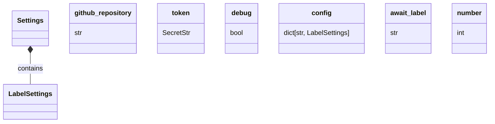

# Label Approved Sub-module Documentation

## Introduction

This sub-module contains settings for label approval workflows, including the await label and issue number. It is used to manage the automatic labeling of issues.

## Core Components

### `LabelSettings`

```python
class LabelSettings(BaseModel):
    await_label: str | None = None
    number: int
```

This component defines the settings for a specific label. It includes:

-   `await_label`: The label to wait for before approving. If not provided, any label will be accepted.
-   `number`: The issue or pull request number to apply the label to.

### `Settings`

```python
class Settings(BaseSettings):
    github_repository: str
    token: SecretStr
    debug: bool | None = False
    config: dict[str, LabelSettings] | Literal[""] = default_config
```

This component defines the overall settings for the label approval process. It includes:

-   `github_repository`: The GitHub repository to operate on.
-   `token`: A GitHub API token for authentication.
-   `debug`: A boolean flag to enable debug mode.
-   `config`: A dictionary mapping label names to `LabelSettings`.

## Workflow

The `Settings` class is initialized with configuration parameters, including a dictionary of `LabelSettings`. The `LabelSettings` specify the conditions under which a label should be automatically applied to an issue or pull request.

## Component Relationships

The `Settings` class contains a dictionary of `LabelSettings`. Each `LabelSettings` instance defines the specific conditions for a particular label.

