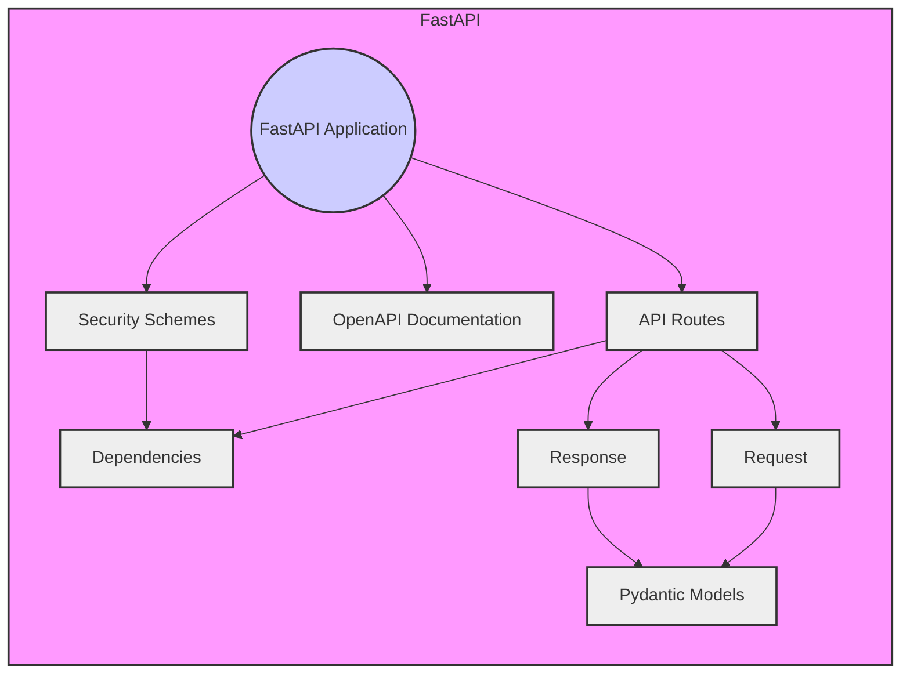

# FastAPI Repository Overview

## Purpose

The FastAPI repository provides a modern, high-performance, web framework for building APIs with Python 3.8+ based on standard Python type hints. It aims to provide a simple and intuitive way to create robust and scalable web APIs with automatic data validation, serialization, and API documentation.

## Architecture

FastAPI is built on top of Starlette for the web parts and Pydantic for data validation and settings management. It leverages Python type hints to define API request and response structures, enabling automatic data validation and serialization. The framework also provides automatic generation of OpenAPI and JSON Schema documentation.

## Core Modules Documentation

- **[Applications](applications.md)**: This module contains the `FastAPI` class, which is the core of the framework. It handles the creation of the API application, routing, middleware, and exception handling.
- **[Routing](routing.md)**: This module defines the `APIRoute` class, which is used to define API endpoints. It handles the association of paths, HTTP methods, dependencies, and request/response models.
- **[Dependencies](dependencies.md)**: This module provides tools for dependency injection, allowing you to define reusable dependencies that can be injected into your API endpoints.
- **[Security](security.md)**: This module provides classes and utilities for implementing various security schemes, such as OAuth2, API Key, and HTTP Basic authentication.
- **[OpenAPI](openapi.md)**: This module handles the automatic generation of OpenAPI and JSON Schema documentation for your API. It uses the defined request and response models to create a comprehensive API specification.
- **[Responses](responses.md)**: This module defines the response types available in FastAPI, including JSON responses, HTML responses, and more. It also allows you to create custom response types.
- **[Params](params.md)**: This module defines the `ParamTypes` enum, which is used to specify the type of parameter (query, path, header, cookie, body, form).
- **[Datastructures](datastructures.md)**: This module defines data structures used in FastAPI, such as `UploadFile` for handling file uploads.
- **[Middleware](middleware.md)**: This module defines the `AsyncExitStackMiddleware` class, which is used to manage the application's middleware stack.

## Additional Information

The repository also includes:

-   `docs_src`: Contains documentation source files and examples. See [Docs_src](docs_src.md) for more details.
-   `scripts`: Contains scripts for automating tasks related to repository management. See [Scripts](scripts.md) for more details.