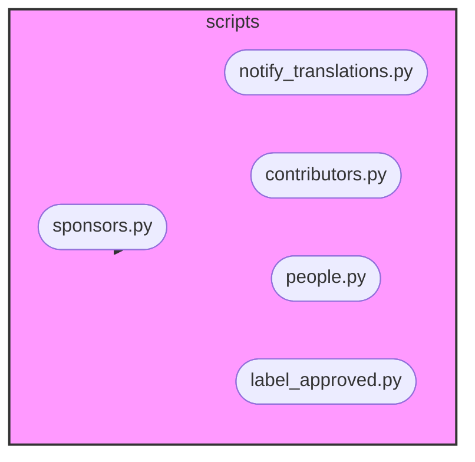

# Scripts Module Documentation

## Introduction

This module contains scripts for automating various tasks related to repository management, such as notifying translators about discussions, managing sponsors, and analyzing contributor activity. It interacts with the GitHub API to retrieve and process data.

## Architecture Overview

The module is structured into several sub-modules, each responsible for a specific set of tasks:

-   **Sponsors**: Handles data related to repository sponsors.
-   **Notify Translations**: Manages notifications to translators regarding discussions.
-   **Contributors**: Analyzes and retrieves data about repository contributors.
-   **People**: Fetches data of people involved in discussions.
-   **Label Approved**: Contains settings related to label approval workflows.

## Sub-modules Functionality

### Sponsors (./sponsors.md)

This sub-module defines data models for handling sponsor-related information. It includes models for sponsors, tiers, and sponsorship details. See ./sponsors.md for more details.

### Notify Translations (./notify_translations.md)

This sub-module focuses on managing notifications to translators. It defines data structures for discussions, comments, and associated events. See ./notify_translations.md for details.

### Contributors (./contributors.md)

This sub-module provides data models for analyzing repository contributors, including pull requests, reviews, and labels. See ./contributors.md for more information.

### People (./people.md)

This sub-module defines data models for people involved in discussions including authors, comments, and replies. See ./people.md for more details.

### Label Approved (./label_approved.md)

This sub-module contains settings for label approval workflows, including the await label and issue number. It is used to manage the automatic labeling of issues. The core components are `Settings` and `LabelSettings`.
