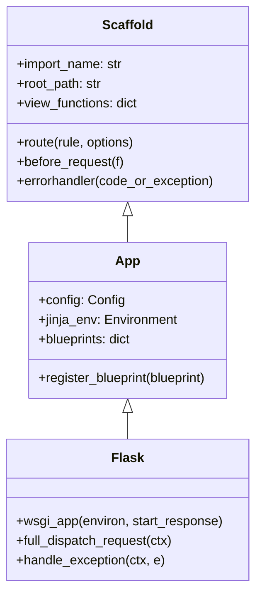
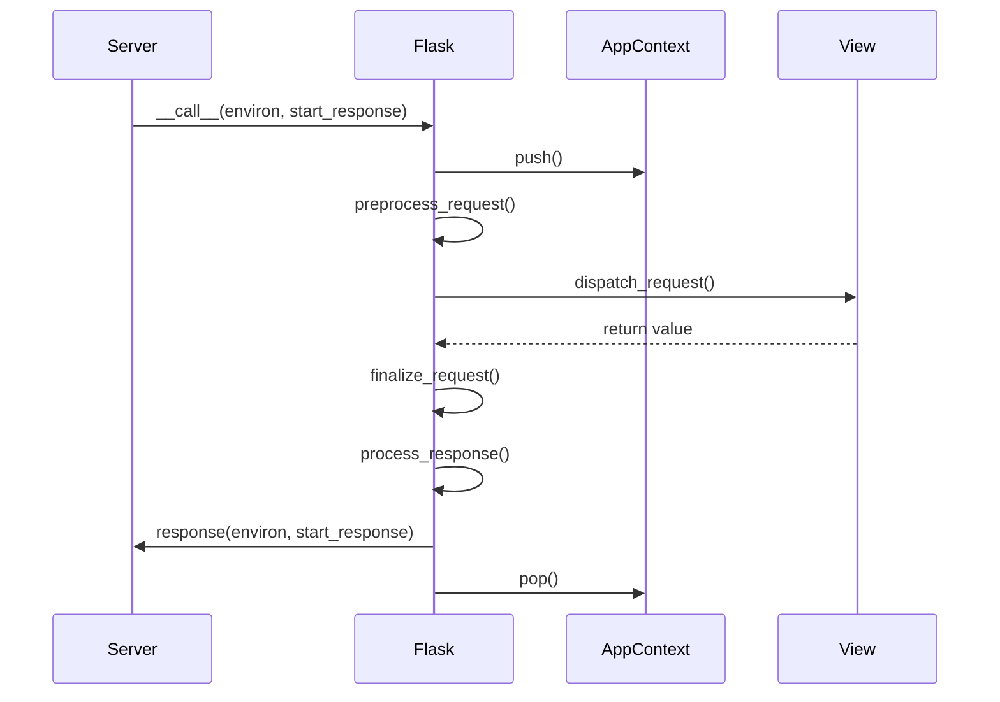

# App Module

The `app` module is the core of the Flask framework. It provides the central application object that coordinates routing, request handling, configuration, and extension management.

## Purpose

The main purpose of this module is to implement the `Flask` application class, which acts as the central registry for view functions, URL rules, template configuration, and more. It follows a layered architecture to separate common registration logic from core application logic and the final WSGI implementation.

## Architecture

The `app` module is built on a hierarchical structure of three primary classes:

1.  **`Scaffold`**: A base class that provides common registration methods (like `@route`, `@before_request`, `@errorhandler`) shared between the `Flask` application and `Blueprint` objects.
2.  **`App`**: A "Sans-IO" application class that extends `Scaffold` with application-specific logic like configuration management, Jinja environment setup, and blueprint registration, without being tied to a specific IO implementation (like WSGI).
3.  **`Flask`**: The final WSGI-compliant application class that implements the request lifecycle, dispatching, and integration with the Werkzeug WSGI server.

## Sub-modules

The `app` module's functionality is divided into the following components:

| Component | Description |
| --- | --- |
| [Scaffold](scaffold.md) | Shared registration logic for Apps and Blueprints. |
| [Sans-IO App](sansio_app.md) | Core application logic and configuration management. |
| [Flask (WSGI)](flask_wsgi.md) | WSGI implementation and request lifecycle management. |

## Core Functionality

### Request Lifecycle

The `Flask` class manages the full lifecycle of an HTTP request:

1.  **WSGI Call**: The server calls the `Flask` object.
2.  **Context Creation**: A request context is created and pushed.
3.  **Preprocessing**: `before_request` functions are executed.
4.  **Dispatching**: The request is matched against the URL map and the corresponding view function is called.
5.  **Postprocessing**: `after_request` functions are executed.
6.  **Response**: The result is converted into a `Response` object and returned to the server.
7.  **Teardown**: `teardown_request` functions are executed as the context is popped.

### Configuration and Extensions

The application maintains a `Config` object for storing settings. Extensions can register themselves with the application by storing state in the `extensions` dictionary.

### Blueprints

Blueprints allow for modular application design. They are registered on the `Flask` object, which then records their routes and handlers.

## Related Modules

- [Blueprints](blueprints.md): Modular application components.
- [Context](ctx.md): Request and application context management.
- [Config](config.md): Configuration handling.
- [Wrappers](wrappers.md): Request and Response objects.
- [CLI](cli.md): Command-line interface integration.
