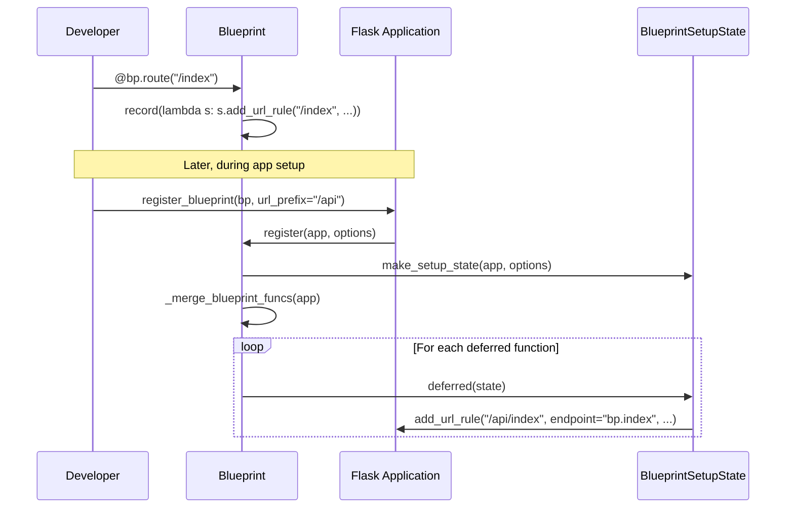
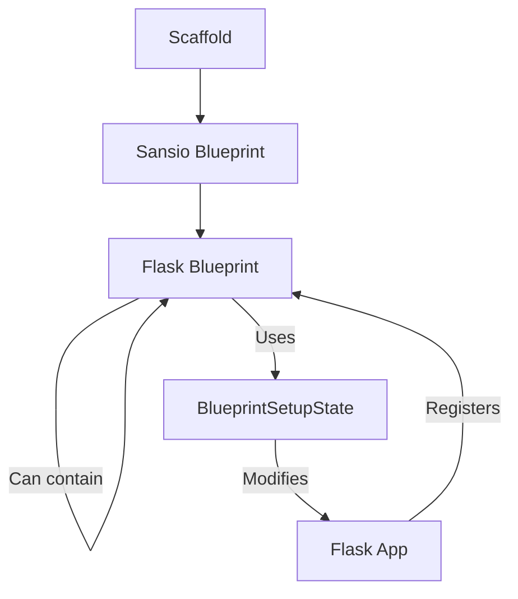

# Blueprints Module

The `blueprints` module provides a way to organize a Flask application into smaller, reusable components. A blueprint defines a collection of routes, error handlers, template filters, and other application-related functions that can be registered on a real application later.

## Overview

Blueprints are "half-finished" applications. They allow developers to:
1. **Organize Large Applications**: Split an application into distinct components (e.g., auth, admin, api).
2. **Reuse Logic**: Define common functionality once and register it multiple times or in different applications.
3. **Namespacing**: Automatically prefix URLs and endpoint names to avoid collisions.

## Core Components

### Blueprint
The [Blueprint](blueprints.md#blueprint) class is the primary interface. It inherits from `Scaffold` and provides decorators similar to the `Flask` application object. However, instead of immediately registering routes or handlers, it "records" these actions as deferred functions.

There are two versions of the Blueprint class:
- `src.flask.sansio.blueprints.Blueprint`: The core logic, independent of I/O or CLI specifics.
- `src.flask.blueprints.Blueprint`: The Flask-specific implementation that adds CLI support (`AppGroup`) and static file serving.

### BlueprintSetupState
The [BlueprintSetupState](blueprints.md#blueprintsetupstate) is a temporary object created during the registration process. It carries the configuration options (like URL prefixes and subdomains) and provides helper methods to apply the recorded changes to the main application object.

## Architecture and Registration Flow

The following diagram illustrates how functions are recorded on a blueprint and later applied to the application during registration.

### Component Relationships

Blueprints follow a hierarchical structure. They can be nested, allowing for complex application architectures.

## Functional Breakdown

### Deferred Execution
Most methods on a blueprint (like `route`, `errorhandler`, `before_request`) do not take immediate effect. Instead, they use:
- `record(func)`: Adds a function to be called with the setup state.
- `record_once(func)`: Ensures the function is only executed the first time the blueprint is registered, even if registered multiple times.

### URL and Endpoint Namespacing
When a blueprint is registered:
1. **URL Prefixing**: Any `url_prefix` defined on the blueprint or passed during registration is prepended to all routes.
2. **Subdomains**: Subdomains are combined if both the blueprint and the registration options specify them.
3. **Endpoints**: All endpoints are prefixed with the blueprint's name (e.g., `index` becomes `my_blueprint.index`).

### Nesting Blueprints
Blueprints can be registered on other blueprints using `register_blueprint`. When the parent blueprint is registered on the application, it recursively registers all its children, correctly propagating URL prefixes and subdomains.

### Global vs. Local Handlers
Blueprints distinguish between local and global handlers:
- **Local**: `before_request`, `after_request`, `errorhandler` only apply to requests handled by that blueprint.
- **Global**: `before_app_request`, `after_app_request`, `app_errorhandler` apply to the entire application, regardless of which blueprint (or the app itself) handles the request.

## Integration with Other Modules

- **App**: Blueprints are registered on the [Flask](app.md) object.
- **CLI**: The Flask implementation of `Blueprint` includes an `AppGroup` from the [cli](cli.md) module to allow blueprints to contribute commands to the `flask` command line.
- **Templating**: Blueprints can have their own `template_folder`, which is integrated into the application's search path via `DispatchingJinjaLoader` in the [templating](templating.md) module.
- **Wrappers**: Static file serving in blueprints uses `Response` objects from the [wrappers](wrappers.md) module.
