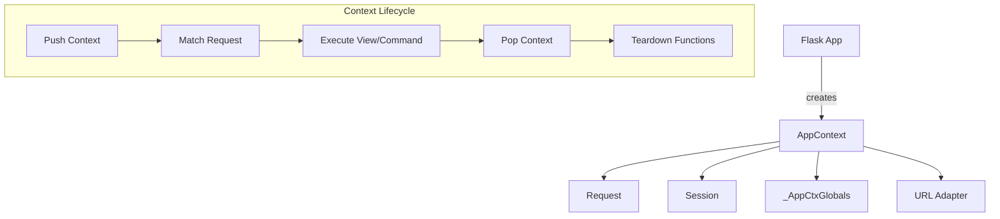
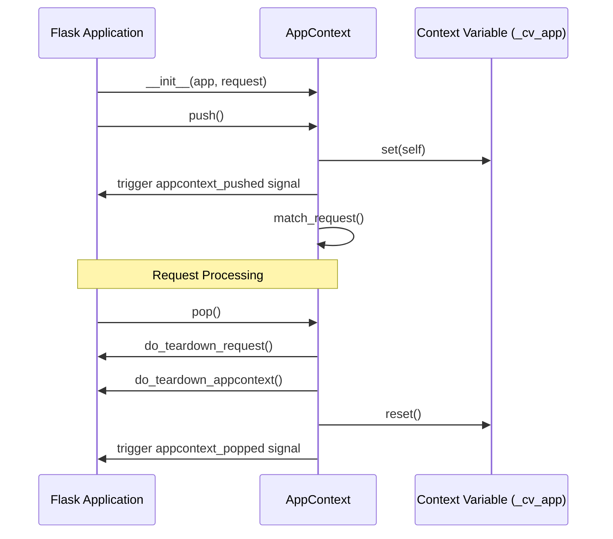

# ctx Module

The `ctx` (Context) module is a core part of Flask that manages the lifecycle of application and request states. It provides the mechanism to track "where" the execution is and provides access to relevant objects like the current application instance, the active request, and session data.

In Flask 3.2+, the previously separate `AppContext` and `RequestContext` have been merged into a single `AppContext` class.

## Overview

Flask uses contexts to make certain objects globally accessible within a specific scope (like a request or a CLI command) without having to pass them around to every function. This is implemented using [Context Variables](https://docs.python.org/3/library/contextvars.html).

### Key Responsibilities
- **State Management**: Storing application and request-specific data.
- **Lifecycle Control**: Handling the setup (`push`) and teardown (`pop`) of the execution environment.
- **Resource Management**: Ensuring that teardown functions (e.g., closing database connections) are called when a context ends.
- **URL Routing**: Matching the current request to a route.

## Core Components

### AppContext
The `AppContext` is the primary container for the execution state. It is pushed at the beginning of each request or CLI command and popped at the end.

- **Storage**: Holds references to the [Flask](app.md) app, the [Request](wrappers.md) object, the [Session](sessions.md), and a namespace for global data (`g`).
- **Nesting**: Supports nested pushes via a `_push_count` mechanism, ensuring teardown only happens when the outermost context is popped.
- **Routing**: Triggers URL matching via `match_request` when a request context is pushed.

### _AppCtxGlobals
Backed by the `g` proxy, this class provides a simple namespace for storing temporary data during a context. It behaves like a plain object but includes dictionary-like methods (`get`, `pop`, `setdefault`).

## Architecture and Data Flow

### Context Relationship
The following diagram shows how `AppContext` ties together various Flask components.



### Request Context Flow
When a request arrives at the Flask application, the following sequence occurs:

1.  **Creation**: `app.app_context(request=request)` is called to create an `AppContext` instance.
2.  **Pushing**: The context is "pushed", setting it as the active context in the current execution unit (thread or task).
3.  **URL Matching**: If a request is present, the `url_adapter` matches the request to a rule.
4.  **Processing**: The application handles the request (dispatching to views).
5.  **Popping**: After the response is generated, the context is "popped".
6.  **Cleanup**: `teardown_request` and `teardown_appcontext` functions are executed.



## Integration with Other Modules

- **[app.md](app.md)**: The `Flask` app creates and manages `AppContext` instances. It also defines the teardown functions that the context calls during `pop()`.
- **[globals.md](globals.md)**: Provides the proxies (`current_app`, `request`, `session`, `g`) that point into the currently active `AppContext`.
- **[wrappers.md](wrappers.md)**: Provides the `Request` and `Response` classes. `AppContext` stores the `Request` instance.
- **[sessions.md](sessions.md)**: The `AppContext` lazily loads the session using the application's `session_interface`.
- **[blueprints.md](blueprints.md)**: URL matching within the context populates the request with blueprint-specific information.

## Usage Patterns

### Manual Context Management
While Flask handles contexts automatically during requests, developers might need to push them manually in scripts or tests:

```python
with app.app_context():
    # current_app and g are now available
    do_something()
```

### Request Context for Testing
To simulate a request:

```python
with app.test_request_context('/path'):
    # request and session are now available
    assert request.path == '/path'
```
