# flask_app Module Documentation

## Introduction

The `flask_app` module, primarily embodied by the `Flask` class, serves as the core of any Flask web application. It provides the central application object that registers routes, handles requests, and manages the application's lifecycle. This module is the entry point for defining the structure and behavior of your web application.

## Core Functionality

The `Flask` application object is responsible for:

*   **Request Handling**: Processing incoming HTTP requests and routing them to the appropriate view functions.
*   **URL Routing**: Mapping URLs to Python functions using decorators.
*   **Configuration Management**: Loading and managing application configuration settings.
*   **Templating**: Integrating with Jinja2 for rendering dynamic HTML content.
*   **Session Management**: Providing mechanisms for managing user sessions.
*   **Blueprints**: Supporting modular application design through Blueprints.
*   **Context Management**: Managing application and request contexts to make certain objects globally accessible during a request.

## Architecture and Component Relationships

At its heart, the `Flask` application orchestrates interactions between various components to deliver a web service. Below is a simplified architecture diagram illustrating its key relationships:

```mermaid
graph TD
    A[Flask Application] --> B[Request Handling]
    A --> C[URL Routing]
    A --> D[Configuration Management]
    A --> E[Templating]
    A --> F[Session Management]
    A --> G[Blueprints]
    A --> H[Context Management]

    A -- depends on --> FlaskBlueprints[flask_blueprints.Blueprint]
    A -- uses --> FlaskConfig[flask_config.Config]
    A -- manages --> FlaskContext[flask_context.AppContext]
    A -- provides --> FlaskGlobals[flask_globals.g, request, session, current_app]
    A -- built on --> FlaskSansio[flask_sansio.App]
    A -- manages --> FlaskSessions[flask_sessions.SessionInterface]
    A -- integrates with --> FlaskTemplating[flask_templating.Environment]
    A -- wraps --> FlaskWrappers[flask_wrappers.Request & Response]

    click FlaskBlueprints "flask_blueprints.md" "View Flask Blueprints Module"
    click FlaskConfig "flask_config.md" "View Flask Config Module"
    click FlaskContext "flask_context.md" "View Flask Context Module"
    click FlaskGlobals "flask_globals.md" "View Flask Globals Module"
    click FlaskSansio "flask_sansio.md" "View Flask Sansio Module"
    click FlaskSessions "flask_sessions.md" "View Flask Sessions Module"
    click FlaskTemplating "flask_templating.md" "View Flask Templating Module"
    click FlaskWrappers "flask_wrappers.md" "View Flask Wrappers Module"
```

*   **`Flask` (A)**: The central application object.
*   **`flask_blueprints`**: Enables modularity by organizing related views and other code. The `Flask` application registers and manages these blueprints.
*   **`flask_config`**: Handles application-wide configuration settings. The `Flask` instance loads and provides access to these settings.
*   **`flask_context`**: Manages the application and request contexts, which are crucial for making certain objects globally available during a request.
*   **`flask_globals`**: Provides proxies (`current_app`, `request`, `session`, `g`) that give access to context-local objects. These proxies abstract away the underlying context management.
*   **`flask_sansio`**: Provides the sans-I/O base application and blueprint classes that `Flask` builds upon for core request dispatching logic without I/O concerns.
*   **`flask_sessions`**: Defines the interface and implementations for managing user sessions, allowing Flask to store session-specific data.
*   **`flask_templating`**: Integrates the Jinja2 templating engine, allowing Flask applications to render dynamic HTML templates.
*   **`flask_wrappers`**: Provides enhanced `Request` and `Response` objects that wrap the underlying Werkzeug request and response objects, adding Flask-specific functionality.

## Integration with Overall System

The `Flask` application is typically the central hub of a Flask-based web service. It integrates with WSGI servers (e.g., Gunicorn, uWSGI) to receive requests and send responses. Developers define application logic by registering routes, error handlers, and other hooks with the `Flask` instance. It can also integrate with various extensions (e.g., Flask-SQLAlchemy for databases, Flask-Login for user management) to extend its capabilities, making it a flexible framework for building a wide range of web applications and APIs.