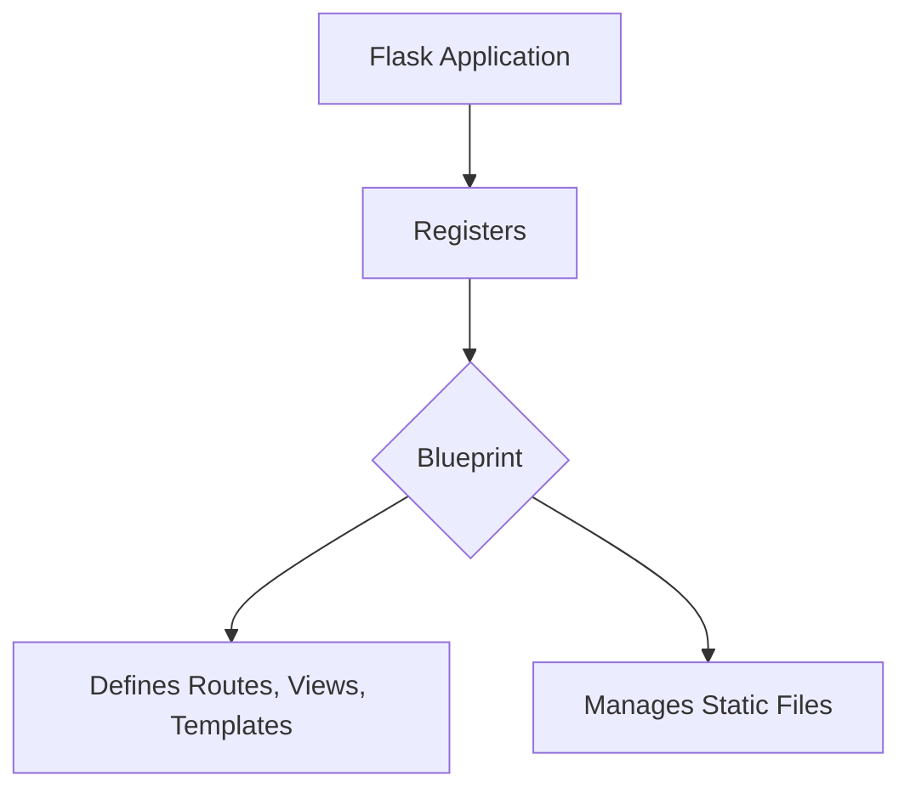

# Flask Blueprints Documentation

## 1. Introduction

The `flask_blueprints` module provides the `Blueprint` object, a fundamental feature in Flask for structuring applications. Blueprints allow you to organize your application into smaller, reusable components, each defining its own set of views, static files, and templates. This modular approach significantly improves maintainability and scalability, especially for larger applications or when developing reusable components that can be registered with multiple Flask applications.

## 2. Core Functionality

A `Blueprint` object works similarly to a Flask application object, but it is not a standalone application. Instead, it is a blueprint for building parts of an application. Key functionalities include:

*   **Modular Organization**: Grouping related views, templates, static files, and other resources into a single, self-contained unit.
*   **URL Prefixing**: Blueprints can be registered with a URL prefix, allowing all routes defined within the blueprint to automatically start with that prefix.
*   **Template Folder Specification**: Each blueprint can specify its own template folder, separate from the main application's templates.
*   **Static File Handling**: Blueprints can manage their own static files, accessible via a blueprint-specific URL.
*   **Subdomain Support**: Blueprints can be configured to handle requests for specific subdomains.
*   **Registration with Applications**: A blueprint must be registered with a Flask application instance using `app.register_blueprint()`. This integrates the blueprint's routes, error handlers, and other components into the application.

### Key Benefits:
*   **Code Organization**: Keeps related code together, making it easier to navigate and understand.
*   **Reusability**: Blueprints can be easily reused across different Flask projects.
*   **Scalability**: Facilitates the growth of an application by allowing features to be developed and managed in isolation.
*   **Team Collaboration**: Multiple teams can work on different parts of an application (different blueprints) without significant conflicts.

## 3. Architecture and Component Relationships

The `flask_blueprints` module, through its `Blueprint` component, acts as a bridge between modular application components and the main Flask application.

In this architecture:
*   The `Flask Application` (from the [flask_app.md](flask_app.md) module) is the central instance that orchestrates the entire web application.
*   A `Blueprint` (from `flask_blueprints`) encapsulates a segment of the application's functionality.
*   The Flask application `registers` one or more Blueprints. Upon registration, the blueprint's definitions (routes, error handlers, template folders, static files) are integrated into the main application.
*   Each Blueprint `Defines Routes, Views, Templates` and `Manages Static Files` specific to its domain.

This relationship allows for a clear separation of concerns, where the main application handles global configurations and shared resources, while blueprints manage specific features or sections of the application.

## 4. How the Module Fits into the Overall System

The `flask_blueprints` module is crucial for developing scalable and well-organized Flask applications. It enables developers to break down a monolithic application into smaller, manageable, and self-contained units. This is particularly beneficial for:

*   **Large Applications**: Organizing features like user management, product catalogs, or API endpoints into distinct blueprints.
*   **RESTful APIs**: Structuring different API versions or resource groups using separate blueprints.
*   **Reusable Components**: Creating generic components (e.g., an authentication system) that can be easily plugged into various Flask projects.

By providing a structured way to extend and organize Flask applications, `flask_blueprints` ensures that applications remain maintainable and comprehensible as they grow in complexity. It works hand-in-hand with other Flask components, allowing views defined in blueprints to interact with the [Request and Response objects](flask_wrappers.md) objects, utilize [Flask Templating](flask_templating.md), and access application context provided by [Flask Context](flask_context.md) and [Flask Globals](flask_globals.md).