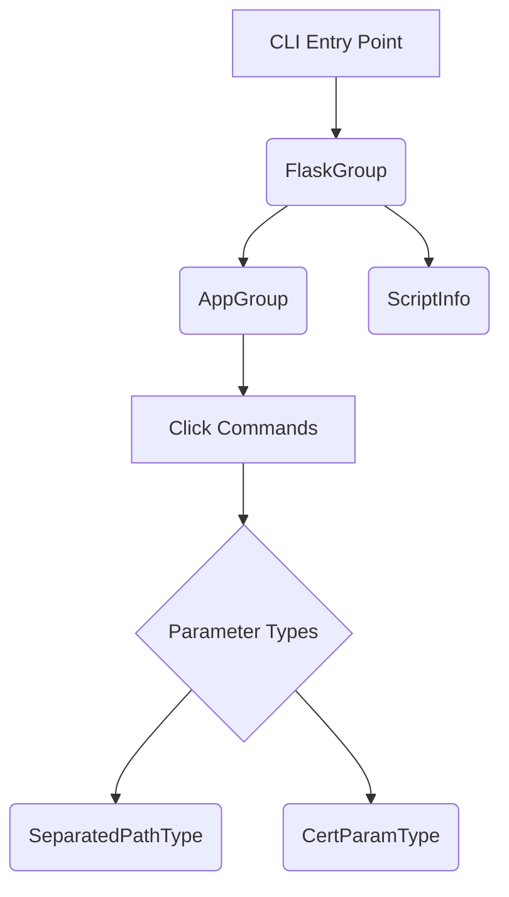

# Flask CLI Module Documentation

## 1. Introduction
The `flask_cli` module provides the command-line interface (CLI) for Flask applications, built on top of the [Click](https://click.palletsprojects.com/) library. It enables developers to interact with their Flask applications directly from the terminal, offering tools for running development servers, managing databases, and performing other application-specific tasks.

## 2. Core Functionality and Components

The `flask_cli` module defines several key components that facilitate the creation and execution of CLI commands for Flask applications:

*   **`ScriptInfo`**: This class is responsible for holding application-specific information when a script is executed. It typically stores the Flask application instance, allowing commands to access the application context.
*   **`AppGroup`**: Extends Click's `Group` class, providing a foundation for command groups that operate within a Flask application context. It ensures that commands are executed with the correct application loaded.
*   **`SeparatedPathType`**: A custom Click parameter type designed to handle paths that might be separated by a specific delimiter. This is useful for commands that require lists of file paths.
*   **`FlaskGroup`**: The primary command group for Flask applications. It integrates `ScriptInfo` and `AppGroup` to create a robust CLI entry point that automatically loads the Flask application. It's the main interface for `flask run`, `flask shell`, and custom commands.
*   **`CertParamType`**: A custom Click parameter type for validating and handling certificate file paths, often used in commands that involve secure connections (e.g., development servers with HTTPS).

## 3. Architecture and Component Relationships

The `flask_cli` module is designed around the Click framework, with `FlaskGroup` acting as the central orchestrator for CLI commands. It ensures that the Flask application context is correctly managed for all executed commands.

*   **CLI Entry Point**: This represents the `flask` command executed in the terminal.
*   **`FlaskGroup`**: This is the main command group that the CLI entry point invokes. It's responsible for setting up the application context.
*   **`AppGroup`**: `FlaskGroup` utilizes `AppGroup` to manage the collection of commands available for the Flask application.
*   **`ScriptInfo`**: `FlaskGroup` uses `ScriptInfo` to load and store information about the Flask application instance, making it accessible to commands.
*   **Click Commands**: These are the actual commands (e.g., `run`, `shell`, or custom commands) defined within the Flask application using Click decorators.
*   **Parameter Types**: Commands often utilize specific parameter types for input validation. `SeparatedPathType` and `CertParamType` are examples of custom types provided by `flask_cli` for specialized input handling.

## 4. How `flask_cli` Fits into the Overall System

The `flask_cli` module serves as the primary interface for developers and maintainers to interact with Flask applications from the command line. It seamlessly integrates with other core Flask modules to provide a comprehensive development and deployment experience:

*   **Application Loading**: It relies on the core Flask application factory (potentially defined in `flask_app` or `flask_sansio`) to load the application instance, ensuring that all configurations and blueprints are correctly initialized.
*   **Configuration Management**: Commands can access application configurations (managed by `flask_config`) through the application context provided by `ScriptInfo`.
*   **Context Handling**: `flask_cli` ensures that CLI commands execute within a proper Flask application context and request context (handled by `flask_context` and `flask_globals`), allowing access to `current_app`, `g`, and other context-local proxies.
*   **Development Server**: The `flask run` command, powered by `flask_cli`, starts a development server, which internally uses Flask's request and response handling (`flask_wrappers`) and potentially templating (`flask_templating`) and session management (`flask_sessions`).

By providing a robust and extensible CLI, `flask_cli` significantly enhances the developer experience, making it easier to build, test, and deploy Flask applications.