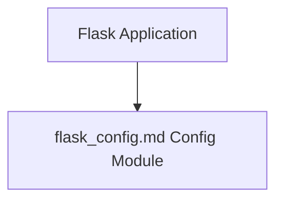

# Flask Config Module Documentation

## Introduction
The `flask_config` module is a crucial component in Flask applications, providing a robust and flexible system for managing application-wide configuration settings. It allows developers to define, load, and access various parameters that dictate the behavior and environment of a Flask application.

## Core Functionality
The `flask_config` module provides the following core components:

### `Config`
The `Config` class is the cornerstone of Flask's configuration system. It behaves like a dictionary but offers enhanced capabilities for loading configuration from multiple sources, including:
*   **Python Files:** Loading configurations from `.py` files, which allows for dynamic configuration based on Python expressions.
*   **Objects:** Loading from any object that has attributes representing configuration keys.
*   **Environment Variables:** Integrating with environment variables, which is essential for deploying applications in different environments (e.g., development, staging, production) without changing the codebase.

The `Config` object stores application settings such as `SECRET_KEY`, database URIs, debug flags, and other custom parameters. It provides a convenient and centralized way to manage these settings throughout the application lifecycle.

### `ConfigAttribute`
`ConfigAttribute` is a descriptor that facilitates access to configuration values as attributes of the `Flask` application object, even though they are stored in the underlying `Config` object. This provides a more intuitive and Pythonic way to retrieve configuration settings, for example, `app.debug` instead of `app.config['DEBUG']`. This abstraction simplifies development by making configuration values feel like native attributes of the application.

## Architecture and Component Relationships
The `flask_config` module primarily interacts with the main `Flask` application instance. The `Config` object is an integral part of the `Flask` application, instantiated and managed by it to hold all relevant configuration data.

The `Flask` application object (from the [flask_app.md](flask_app.md) module) directly utilizes the `Config` class to manage its settings. `ConfigAttribute` instances are typically set on the `Flask` application class to proxy access to the underlying `Config` object's values.

## Integration with the Overall System
The `flask_config` module is fundamental to the entire Flask ecosystem. It serves as the central repository for all application settings, influencing almost every aspect of a Flask application's behavior. From database connections and secret key management to debug mode activation and custom extension configurations, the `Config` object is consulted.

It enables developers to create flexible and environment-aware applications by allowing configurations to be easily swapped based on the deployment environment. This modular approach to configuration management ensures that applications can be easily adapted and maintained across various development and production stages.
