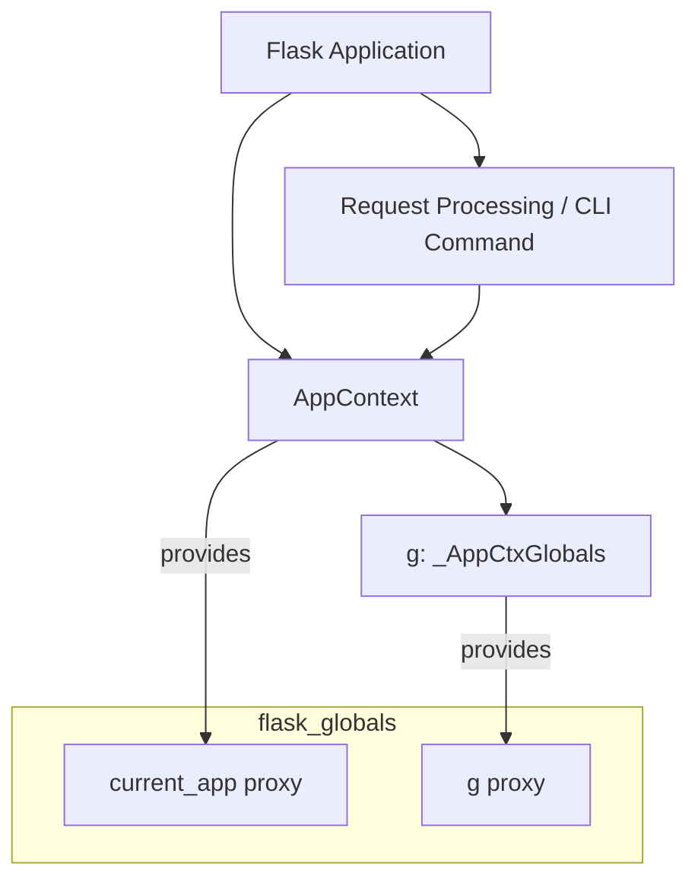

# Flask Context Module

## Introduction

The `flask_context` module in Flask is fundamental for managing the application context. It provides the core components for handling application-wide data and resources that are accessible throughout a request or CLI command. This module ensures that certain objects, like the current application (`current_app`) and application-specific global variables (`g`), are available without explicit passing, simplifying development and maintaining a clean API.

## Core Functionality and Architecture

The `flask_context` module primarily exposes two key components: `AppContext` and `_AppCtxGlobals`.

### AppContext

The `AppContext` class is responsible for managing the lifecycle of an application context. When a Flask application starts processing a request or a CLI command, an `AppContext` is pushed onto a stack. This makes the application instance available globally as `current_app` (via a proxy in [flask_globals.md](flask_globals.md)). When the request or command finishes, the `AppContext` is popped, and any associated cleanup tasks are performed.

Key responsibilities of `AppContext` include:
-   Registering and unregistering the application with the context locals.
-   Managing the `_AppCtxGlobals` instance for the current context.
-   Providing a mechanism for teardown functions to be executed when the context is popped.

### _AppCtxGlobals

`_AppCtxGlobals` is a simple object that provides a namespace for storing application-specific data. It is typically accessed through the `g` proxy (also defined in [flask_globals.md](flask_globals.md)). This object allows developers to store and retrieve data that is local to a specific application context, ensuring that different requests or CLI commands do not interfere with each other's data.

Common uses for `g` include:
-   Storing database connections.
-   Caching per-request data.
-   Making external resources available throughout a request.

## Module Relationships and System Fit

The `flask_context` module is a cornerstone of the Flask framework, providing the mechanism for context management that many other Flask components rely on. It works in close conjunction with:

*   **[flask_globals.md](flask_globals.md)**: This module provides the proxy objects (`current_app`, `g`, `request`, `session`) that make the context-bound variables easily accessible throughout your application code. `flask_globals` directly uses the context management provided by `flask_context`.
*   **[flask_app.md](flask_app.md)**: The `Flask` application class itself is responsible for creating and pushing `AppContext` instances during request processing and CLI command execution.
*   **[flask_blueprints.md](flask_blueprints.md)**: Blueprints operate within the application context, and their functions and decorators rely on the availability of `current_app` and `g`.

This contextual approach ensures that Flask applications remain thread-safe and that resources are properly managed for each individual request or task.

## Architecture Diagram

