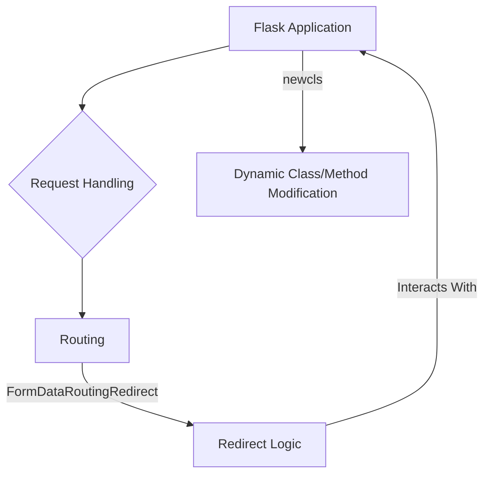

# Flask Debug Helpers Module Documentation

## Introduction

The `flask_debug_helpers` module provides utilities to assist in debugging Flask applications, primarily focusing on request handling and routing. It offers tools that can help diagnose issues related to form data, redirects, and potentially dynamic introspection of application components.

## Core Components

### `newcls`

The `newcls` component is a helper utility often used for dynamic class creation or modification within a debugging context. While its specific implementation details can vary, it typically facilitates: 

*   **Runtime Class Generation:** Creating new classes on the fly for testing or mocking purposes.
*   **Method Patching:** Temporarily overriding methods of existing classes to inject debugging logic or alter behavior without modifying the original source code.
*   **Introspection:** Gaining deeper insights into the structure and behavior of objects during runtime.

This utility is particularly useful in scenarios where you need to inspect or alter the behavior of Flask internals or third-party libraries without permanently changing their code.

### `FormDataRoutingRedirect`

The `FormDataRoutingRedirect` component is designed to assist in debugging issues related to form data submission and subsequent redirects within a Flask application. Its primary purpose is to help identify and resolve problems that might occur when a user submits a form, and the application attempts to redirect them to another URL.

Key aspects include:

*   **Form Data Preservation:** In certain debugging scenarios, it might help in understanding how form data is handled across redirects, especially when unexpected data loss or processing issues occur.
*   **Routing Diagnostics:** It can be instrumental in tracing the flow of control after a form submission, ensuring that the correct route is being invoked and that redirects are happening as expected.
*   **Debugging Redirect Loops:** This component could be part of a larger mechanism to detect or prevent infinite redirect loops caused by faulty routing logic or improper handling of form submissions.

## Architecture and Component Relationships

The `flask_debug_helpers` module integrates with the core Flask application, providing tools that can intercept or modify aspects of the request-response cycle for debugging purposes. It works in conjunction with the main [Flask application](flask_app.md) and potentially interacts with [request and response wrappers](flask_wrappers.md) to inspect or alter their behavior.

## How the Module Fits into the Overall System

The `flask_debug_helpers` module serves as a crucial toolkit for developers and maintainers to troubleshoot and understand the behavior of Flask applications. It provides low-level debugging capabilities that complement higher-level logging and error reporting. By offering fine-grained control over runtime introspection and request flow analysis, it significantly aids in identifying and resolving complex issues, especially those related to routing, form submissions, and dynamic component interactions. This module is typically used during development and testing phases to ensure the robustness and correctness of the application.