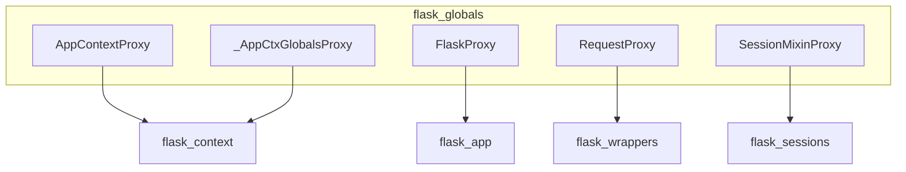

# flask_globals Module Documentation

## Introduction

The `flask_globals` module provides essential proxy objects that allow for easy, thread-local access to various core Flask components within an application context. These proxies abstract away the underlying context management, enabling developers to interact with the current application, request, session, and application context globals as if they were directly accessible.

## Architecture and Component Relationships

The `flask_globals` module acts as an intermediary, providing proxy access to objects managed by other core Flask modules. The following diagram illustrates its relationship with the modules it proxies:

## Core Functionality and Components

The `flask_globals` module exposes several proxy objects, all inheriting from `ProxyMixin`, to provide convenient access to context-local objects.

### `ProxyMixin`

The base mixin for all proxy objects in this module. It provides the core functionality for delegating attribute access to the wrapped object within the current context.

### `_AppCtxGlobalsProxy`

This proxy provides access to the application context globals object, typically an instance of [`_AppCtxGlobals`](flask_context.md) from the `flask_context` module. It allows storing and retrieving application-specific data that is local to the current application context.

### `FlaskProxy`

A proxy for the current Flask application instance, which is typically an instance of [`Flask`](flask_app.md) from the `flask_app` module. Through this proxy, developers can access application-wide configuration, extensions, and other properties of the active Flask application.

### `SessionMixinProxy`

This proxy provides access to the current session object, which implements the `SessionMixin` interface (defined in [`flask_sessions`](flask_sessions.md)). It allows developers to interact with session-specific data, such as storing and retrieving user-specific information across requests.

### `RequestProxy`

A proxy for the current request object, typically an instance of [`Request`](flask_wrappers.md) from the `flask_wrappers` module. It allows access to all properties and methods of the incoming HTTP request, such as form data, headers, URL parameters, and more.

### `AppContextProxy`

This proxy provides access to the current application context object, typically an instance of [`AppContext`](flask_context.md) from the `flask_context` module. It allows direct interaction with the application context itself, which manages the lifespan of various application-level objects.

## Integration with the Overall System

The `flask_globals` module is a fundamental part of Flask's context management system. It relies heavily on the thread-local storage provided by Flask's context locals (`_app_ctx_stack`, `_request_ctx_stack`) to ensure that the correct application, request, and session objects are accessible at any given time, regardless of the thread handling the request.

By providing these global proxies, Flask simplifies application development by allowing direct access to `current_app`, `request`, `session`, and `g` (application context globals) without explicit passing of these objects through function calls. This design choice makes Flask applications feel more "global" within a request-response cycle, while still maintaining thread isolation.