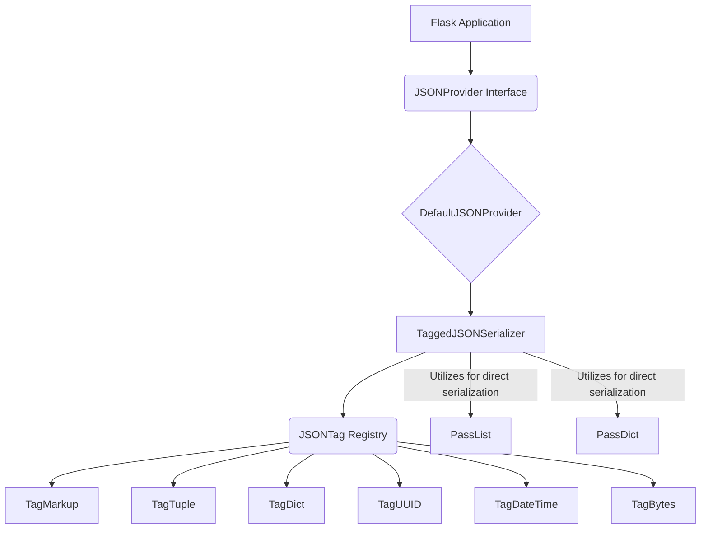

# Flask JSON Module

## Introduction

The `flask_json` module is a crucial component of Flask, providing robust and flexible JSON serialization and deserialization capabilities. It enables Flask applications to seamlessly handle JSON data, which is fundamental for building web APIs and communicating with modern web clients. This module focuses on extensibility, allowing developers to define custom serialization rules for complex Python objects.

## Core Functionality and Components

The `flask_json` module offers a sophisticated mechanism for converting Python objects to JSON and back, with a particular emphasis on tagging objects to preserve their type information during serialization. This ensures that complex data structures can be faithfully reconstructed after deserialization.

### `JSONProvider`

The `JSONProvider` is an abstract base class that defines the interface for JSON serialization and deserialization in Flask. It specifies the methods that any JSON provider must implement, such as `dumps` for serializing Python objects to JSON strings and `loads` for deserializing JSON strings back into Python objects.

### `DefaultJSONProvider`

The `DefaultJSONProvider` is the default implementation of the `JSONProvider`. It provides standard JSON serialization and deserialization, often utilizing Python's built-in `json` module. It also incorporates the tagging system to handle Flask-specific object types and custom objects configured by the application.

### Tagging System (`JSONTag`, `TaggedJSONSerializer`, `Tag*` classes)

The tagging system is at the heart of `flask_json`'s advanced serialization capabilities. It allows for the serialization of complex or non-standard Python types by attaching a "tag" that identifies their original type. When deserializing, `TaggedJSONSerializer` uses these tags to reconstruct the original Python objects.

*   **`JSONTag`**: A base class for defining custom JSON tags. Each specific tag type (e.g., `TagUUID`, `TagDateTime`) inherits from this.
*   **`TaggedJSONSerializer`**: The serializer that orchestrates the tagging and untagging process. It manages a registry of tag handlers and is responsible for converting tagged objects to a JSON-compatible format and vice-versa.
*   **`TagMarkup`**: Handles the serialization and deserialization of Jinja2 `Markup` objects.
*   **`TagTuple`**: Manages the serialization and deserialization of tuples, ensuring they are correctly reconstructed as tuples rather than lists (which is the default JSON array mapping).
*   **`TagDict`**: Handles dictionary serialization, potentially with custom logic for specific dictionary types or keys.
*   **`TagUUID`**: Provides serialization for `uuid.UUID` objects, converting them to string representations and back.
*   **`TagDateTime`**: Serializes `datetime` objects into a standardized string format (e.g., ISO 8601) and deserializes them back to `datetime` objects.
*   **`TagBytes`**: Converts `bytes` objects to a JSON-compatible format (e.g., base64 encoded strings) and reconstructs them.

### Pass-Through Types (`PassList`, `PassDict`)

These components are likely used to explicitly mark certain lists or dictionaries that should be serialized directly without any special tagging or processing, acting as simple pass-through mechanisms within the tagging system.

*   **`PassList`**: Indicates a list that should be serialized as a standard JSON array.
*   **`PassDict`**: Indicates a dictionary that should be serialized as a standard JSON object.

## Architecture and Component Relationships

The `flask_json` module's architecture revolves around the `JSONProvider` interface, with `DefaultJSONProvider` serving as the primary implementation. The core of its advanced features is the `TaggedJSONSerializer` and its associated `JSONTag` subclasses, which enable intelligent serialization of various Python types.

## Integration with the Overall System

The `flask_json` module is tightly integrated with the core Flask application (`flask_app`). When a Flask application needs to send or receive JSON data, it consults the configured `JSONProvider` (typically `DefaultJSONProvider`).

For instance:
*   When a view function returns a dictionary or a list, Flask's `Response` object (`flask_wrappers.md`) uses the `JSONProvider` to serialize this Python object into a JSON string, which is then sent as the HTTP response body with the appropriate `Content-Type: application/json` header.
*   Conversely, when an incoming HTTP request has a `Content-Type: application/json` header, Flask's `Request` object (`flask_wrappers.md`) uses the `JSONProvider` to deserialize the request body JSON string into a Python object, making it accessible through `request.json` or `request.get_json()`.

This module ensures that developers can work with Python objects directly, abstracting away the complexities of JSON serialization and deserialization, while also providing hooks for extending this behavior for custom types.

Refer to [flask_app.md](flask_app.md) for how the overall Flask application utilizes this module, and [flask_wrappers.md](flask_wrappers.md) for details on `Request` and `Response` objects that interact with JSON data.
