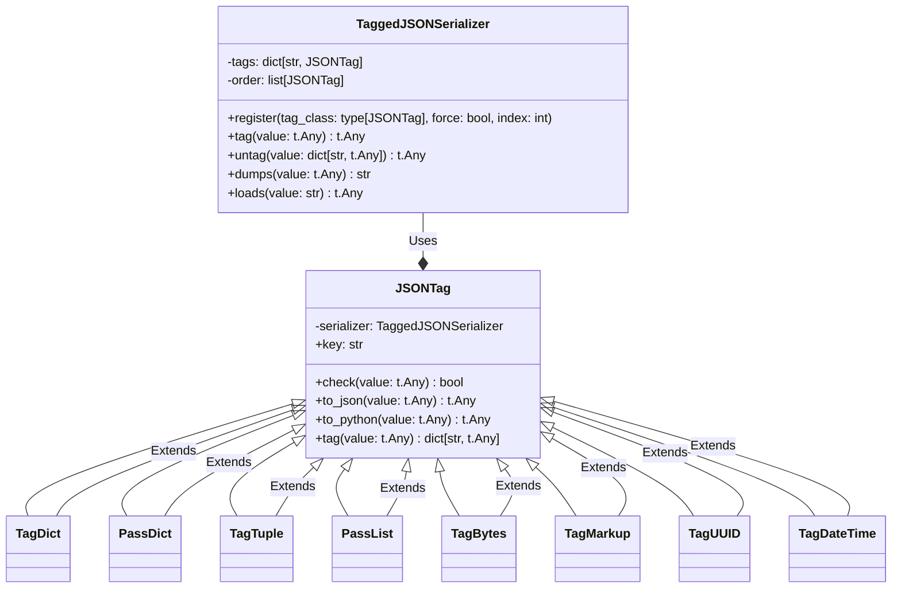

# flask_json_tag Module Documentation

## Introduction

The `flask_json_tag` module provides a mechanism for extending Flask's JSON serialization capabilities to handle more complex data types. It introduces a tagging system that allows the `TaggedJSONSerializer` to compactly represent objects that are not natively JSON types, such as dictionaries, tuples, bytes, UUIDs, and datetime objects. This ensures that these objects can be serialized and deserialized without losing their original type information.

## Architecture

The core of this module is the `TaggedJSONSerializer`, which utilizes a collection of `JSONTag` classes to identify and transform specific data types. Each `JSONTag` is responsible for checking if a given value matches its type, converting the value to a JSON-compatible representation, and converting it back to its original Python type during deserialization.



## Core Components

### TaggedJSONSerializer

This class is the central serializer that manages the registration and application of `JSONTag` classes. It provides methods for:

*   Registering new tags with the `register` method, allowing custom type handling.
*   Tagging values using the `tag` method, which iterates through registered tags and applies the first matching tag.
*   Untagging values with the `untag` method, which reverses the tagging process during deserialization.
*   Dumping tagged values to JSON strings with the `dumps` method.
*   Loading JSON strings and deserializing tagged objects with the `loads` method.

### JSONTag

This is an abstract base class for creating custom type tags. Subclasses must implement the following methods:

*   `check(value)`: Determines if the tag should be applied to the given value.
*   `to_json(value)`: Converts the Python object into a JSON-compatible representation.
*   `to_python(value)`: Converts the JSON representation back into the original Python object.
*   `tag(value)`:  Combines the tag key and the JSON representation of value into a dictionary.

The `key` attribute is used to identify the tag during deserialization.

### Concrete JSONTag Implementations

The module includes several concrete implementations of `JSONTag` for handling specific data types:

*   **TagDict**: Handles dictionaries where the key matches a registered tag. This is used to tag nested objects.
*   **PassDict**: Handles dictionaries by recursively tagging their values, ensuring nested objects are properly serialized.
*   **TagTuple**: Handles tuples by converting each item in the tuple to its tagged representation.
*   **PassList**: Handles lists by converting each item in the list to its tagged representation.
*   **TagBytes**: Handles bytes by encoding them to base64.
*   **TagMarkup**: Handles objects with a `__html__` method (typically from `markupsafe.Markup`) by calling the method and converting the result to a string.
*   **TagUUID**: Handles UUID objects by converting them to their hexadecimal representation.
*   **TagDateTime**: Handles datetime objects by formatting them as HTTP dates.

## Data Flow

```mermaid
sequenceDiagram
    participant Client
    participant Flask
    participant TaggedJSONSerializer
    participant JSONTag

    Client->>Flask: Request with data (e.g., datetime object)
    Flask->>TaggedJSONSerializer: dumps(data)
    activate TaggedJSONSerializer
    loop For each JSONTag in order
        TaggedJSONSerializer->>JSONTag: check(data)
        alt Tag matches
            TaggedJSONSerializer->>JSONTag: to_json(data)
            JSONTag-->>TaggedJSONSerializer: JSON-compatible data
            TaggedJSONSerializer->>JSONTag: tag(data)
            JSONTag-->>TaggedJSONSerializer: Tagged data
            break
        end
    end
    TaggedJSONSerializer-->>Flask: JSON string with tagged data
    deactivate TaggedJSONSerializer
    Flask-->>Client: Response with JSON string

    Client->>Flask: Request for data (JSON string)
    Flask->>TaggedJSONSerializer: loads(data)
    activate TaggedJSONSerializer
    loop Recursively untag data
    TaggedJSONSerializer->>TaggedJSONSerializer: _untag_scan(data)
        alt Data is a dict with a tag
            TaggedJSONSerializer->>JSONTag: to_python(value)
            JSONTag-->>TaggedJSONSerializer: Python object
        else Data is a list
            TaggedJSONSerializer->>TaggedJSONSerializer: _untag_scan(item) for each item
        else Data is a dict
            TaggedJSONSerializer->>TaggedJSONSerializer: _untag_scan(value) for each value
        end
    end
   TaggedJSONSerializer-->>Flask: Python object with original types
    deactivate TaggedJSONSerializer

deactivate TaggedJSONSerializer
    Flask-->>Client: Response deactivate TaggedJSONSerializer
    Flask-->>Client: Responsedeactivate TaggedJSONSerializer
```

## Usage

The `TaggedJSONSerializer` can be integrated into Flask by configuring the `Flask.json_provider_class` to use a provider that utilizes it. See [flask_json_provider.md](flask_json_provider.md) for more details.

## Module Relationships

This module interacts closely with the [flask_json_provider.md](flask_json_provider.md) module, which is responsible for providing JSON handling capabilities to Flask.  It extends the base JSON handling by adding support for tagged serialization.
