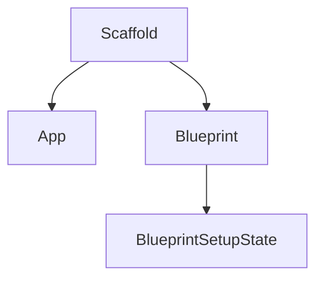

# flask_sansio Module Documentation

## Introduction
The `flask_sansio` module provides the core sans-I/O components for Flask, enabling a flexible and testable application architecture by decoupling the application logic from the underlying I/O mechanisms. This module introduces fundamental building blocks such as `App`, `Blueprint`, and `Scaffold`, which are essential for constructing Flask applications without direct reliance on specific web server interfaces.

## Architecture and Core Components

The `flask_sansio` module is built around several key components that facilitate the sans-I/O design. These components work together to provide a robust and extensible foundation for Flask applications.

### Core Components
*   **App**: Represents the sans-I/O application object. It manages the application's configuration, teardown functions, and provides the central point for dispatching requests without directly handling the HTTP protocol. The `App` component in `flask_sansio` serves as the base for the main `Flask` application object found in [flask_app.md](flask_app.md).
*   **Blueprint**: A sans-I/O blueprint provides a mechanism to organize a group of related views, static files, and templates. It defers registration with the application until later, allowing for modularity and reusability. The `Blueprint` component here is a sans-I/O version of the more comprehensive `Blueprint` in [flask_blueprints.md](flask_blueprints.md).
*   **Scaffold**: This component serves as a base class for both `App` and `Blueprint`, providing common functionalities and attributes like name and static file handling. It ensures consistency across these core structures.
*   **BlueprintSetupState**: An internal helper class that holds the state during the setup process of a Blueprint, managing configurations and deferred functions.

### Architecture Diagram

## How it Fits into the Overall System

The `flask_sansio` module forms the foundational layer of a Flask application's core logic. By separating the application's request processing and response generation from the actual network I/O, it allows Flask to be highly adaptable to various deployment environments, including WSGI, ASGI, and testing frameworks.

The `App` component in `flask_sansio` is extended by the `Flask` class in the [flask_app.md](flask_app.md) module, which adds the WSGI application interface and other I/O specific functionalities. Similarly, the `Blueprint` component provides the sans-I/O capabilities that are further built upon by the `Blueprint` class in [flask_blueprints.md](flask_blueprints.md), enabling modular application development.

This sans-I/O design promotes:
*   **Testability**: Application logic can be tested in isolation without needing to mock HTTP requests or responses.
*   **Flexibility**: The same application logic can be deployed with different I/O layers (e.g., synchronous WSGI servers or asynchronous ASGI servers).
*   **Maintainability**: Clear separation of concerns makes the codebase easier to understand and manage.

The components within `flask_sansio` work closely with other modules like [flask_config.md](flask_config.md) for application configuration, [flask_context.md](flask_context.md) for managing application and request contexts, and [flask_globals.md](flask_globals.md) for providing proxy access to context-local objects.