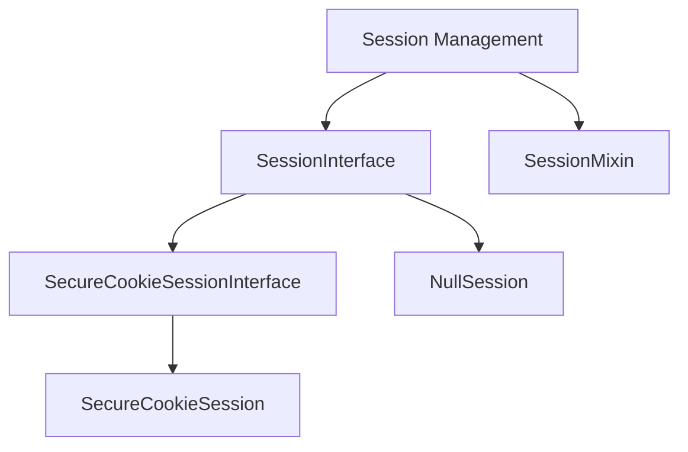

# Flask Sessions Module

## Introduction

The `flask_sessions` module in Flask is responsible for managing user sessions, providing a mechanism to store data associated with a specific user across multiple requests. It offers different implementations for session handling, with a focus on secure, signed cookie-based sessions by default.

This module defines the interfaces and concrete implementations for session management, allowing developers to choose or implement their own session storage mechanisms.

## Architecture and Component Relationships

The `flask_sessions` module revolves around the `SessionInterface` and `SessionMixin` components, which define the contract and common functionalities for session management. `SecureCookieSessionInterface` provides the default, secure cookie-based session handling.

### Component Details

#### `SessionInterface`

`SessionInterface` is an abstract base class that defines the API for session management. Any custom session implementation in Flask must inherit from this class and implement its methods for loading and saving session data. It acts as the bridge between the Flask application and the underlying session storage mechanism.

#### `SecureCookieSessionInterface`

This is the default session interface provided by Flask. It stores session data in a cryptographically signed cookie on the client-side. The session data is serialized, signed with a secret key to prevent tampering, and then stored in the user's browser cookie. This approach avoids server-side storage, making it suitable for stateless applications.

#### `SecureCookieSession`

Represents a session object managed by the `SecureCookieSessionInterface`. It is a dictionary-like object that holds the actual session data. When changes are made to this object, `SecureCookieSessionInterface` is responsible for serializing and storing these changes back into the secure cookie.

#### `NullSession`

`NullSession` is an implementation of `SessionInterface` that effectively disables sessions. When this interface is used, no session data is stored or retrieved, and any attempts to access or modify session variables will have no effect. It can be useful in scenarios where session management is explicitly not required.

#### `SessionMixin`

`SessionMixin` provides helper methods and properties related to session handling. It is typically mixed into the `Request` object (see [flask_wrappers.md](flask_wrappers.md)) to provide easy access to the current session object via `request.session` or similar attributes.

## Integration with Flask System

The `flask_sessions` module is a fundamental part of the Flask ecosystem, enabling stateful interactions over the stateless HTTP protocol. It integrates closely with the `Flask` application object (see [flask_app.md](flask_app.md)) which is configured with a `SECRET_KEY` necessary for signing the secure cookies.

When a request comes in, the `SessionInterface` implementation (by default `SecureCookieSessionInterface`) is responsible for loading the session data from the incoming request (e.g., from a cookie). This session object is then made available through the request context, often via a `SessionMixin` on the request object.

After the request is processed and before the response is sent, the `SessionInterface` saves any modified session data back to the appropriate storage (e.g., setting a new secure cookie in the response).