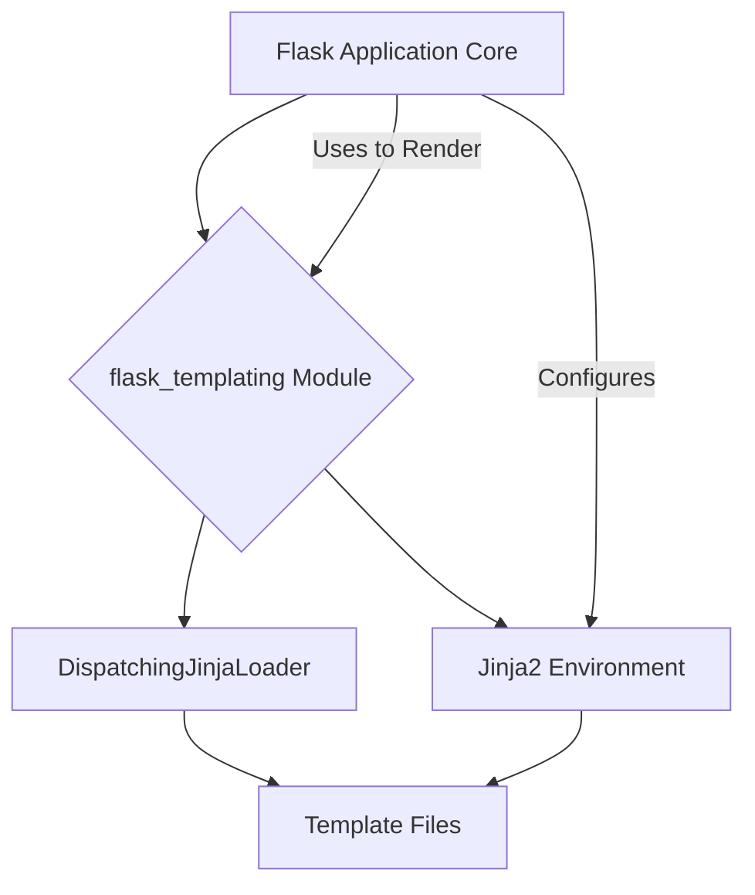

# Flask Templating Module (`flask_templating`)

## Introduction

The `flask_templating` module is responsible for integrating the Jinja2 templating engine into Flask applications. It provides the necessary components to load, manage, and render templates, allowing developers to create dynamic HTML content.

## Core Functionality and Components

This module primarily revolves around two core components: `DispatchingJinjaLoader` and `Environment`.

### `DispatchingJinjaLoader`

The `DispatchingJinjaLoader` is a custom Jinja2 loader designed for Flask. Its primary function is to intelligently locate templates within a Flask application. It understands Flask's application and blueprint structure, allowing templates to be organized and discovered from various locations, such as the application's `templates` folder or within blueprint-specific `templates` folders. This loader is crucial for enabling modular template organization in larger Flask applications.

### `Environment`

The `Environment` component in `flask_templating` represents the Jinja2 templating environment. It's an instance of `jinja2.Environment` configured specifically for Flask. This environment holds the configuration for template loading, global variables, filters, tests, and other Jinja2 extensions. It's responsible for parsing template files, compiling them, and rendering them with context data. Flask configures this environment to provide access to common Flask-specific globals (like `request`, `session`, `g`, `url_for`, etc.) within templates.

## Architecture and Component Relationships

The `flask_templating` module sits between the Flask application core and the Jinja2 templating engine. It relies on the main `flask_app` for configuration and context and provides the templating capabilities used by views to render responses.

## How the Module Fits into the Overall System

The `flask_templating` module is a fundamental part of Flask's request-response cycle for web applications. When a client makes a request, Flask routes it to a view function. If that view function needs to generate an HTML response, it typically calls `render_template()`.

The `render_template()` function, provided by Flask, uses the `Environment` configured by `flask_templating` to load and render the specified template. The `DispatchingJinjaLoader` helps the `Environment` find the correct template file, taking into account the current application or blueprint context. The rendered HTML is then returned as part of the `Response` object (handled by `flask_wrappers`).

This module ensures a clean separation of concerns, allowing developers to define application logic in Python and presentation logic in Jinja2 templates.
