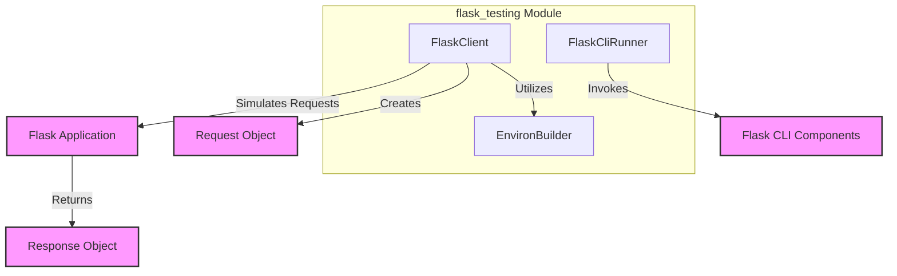

# flask_testing

The `flask_testing` module provides essential utilities for testing Flask applications efficiently. It offers tools to simulate client interactions, execute command-line interface (CLI) commands, and construct various testing environments, making it easier to ensure the reliability and correctness of Flask-based projects.

## Core Components

### `FlaskClient`
The `FlaskClient` component extends Flask's standard testing client, providing a high-level interface for simulating HTTP requests against a Flask application. It simplifies the process of sending requests and examining responses within a test suite, offering methods for common HTTP verbs (GET, POST, PUT, DELETE, etc.).

### `FlaskCliRunner`
`FlaskCliRunner` is designed to facilitate the testing of Flask command-line interface (CLI) commands. It allows developers to programmatically invoke `flask` commands and capture their output, enabling comprehensive testing of CLI functionalities. For more details on Flask CLI, refer to the [flask_cli.md](flask_cli.md) documentation.

### `EnvironBuilder`
The `EnvironBuilder` component assists in constructing a WSGI environment for testing. It provides a flexible way to define and customize request parameters, headers, and other environmental variables that are crucial for simulating specific testing scenarios. This component is often used internally by `FlaskClient` but can also be utilized directly for more granular control over the test environment.

## Architecture and Component Relationships

The `flask_testing` module integrates closely with other core Flask modules to provide a robust testing framework.

## How the Module Fits into the Overall System

The `flask_testing` module is an indispensable part of the development lifecycle for Flask applications, providing the necessary infrastructure to implement unit and integration tests. It allows developers to:

*   **Validate HTTP Endpoints**: By simulating client requests, `FlaskClient` helps verify that web endpoints behave as expected, handle different inputs correctly, and return appropriate responses.
*   **Test CLI Commands**: `FlaskCliRunner` ensures that custom `flask` commands, often used for database migrations, data seeding, or administrative tasks, function correctly.
*   **Isolate Test Environments**: `EnvironBuilder` contributes to creating controlled and isolated test environments, preventing side effects between tests and ensuring reproducible results.

By leveraging `flask_testing`, developers can build more robust and maintainable Flask applications through comprehensive automated testing. It acts as a bridge between the application code and the testing framework, facilitating the creation of reliable test suites.