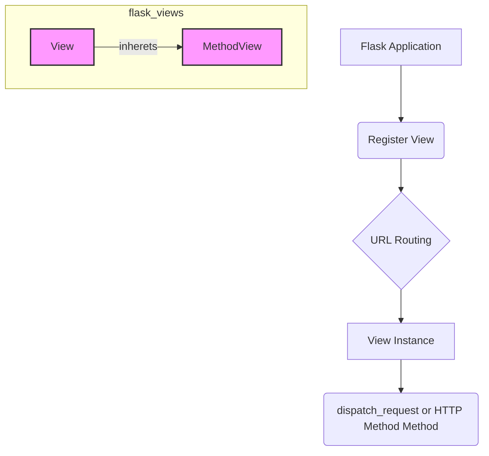

# Flask Views Module Documentation

## Introduction

The `flask_views` module provides class-based views for Flask applications, offering an alternative to traditional function-based views. It helps organize request handling logic into classes, promoting reusability and better structure, especially for RESTful APIs or complex applications.

## Core Functionality

The module introduces two primary class-based view components: `View` and `MethodView`.

### View

The `View` class is a base class for generic class-based views. It allows developers to define a `dispatch_request` method which will be called when a request matches the view's registered URL rule. This provides a structured way to handle requests, especially when different HTTP methods (GET, POST, etc.) for the same endpoint share common setup or teardown logic.

#### Key Features:
*   **Centralized Request Handling:** All HTTP methods for a given endpoint are handled within a single `dispatch_request` method.
*   **Flexibility:** Can be used for simple pages or more complex request processing.
*   **Inheritance:** Encourages creating reusable base view classes.

### MethodView

The `MethodView` class extends the `View` concept by automatically dispatching requests to methods named after the HTTP method (e.g., `get()` for GET requests, `post()` for POST requests, `put()` for PUT requests, etc.). This simplifies the implementation of RESTful APIs where different HTTP methods perform distinct operations on a resource.

#### Key Features:
*   **RESTful API Design:** Directly supports HTTP verb-based routing.
*   **Code Organization:** Each HTTP method gets its own dedicated method within the view class, improving readability and maintainability.
*   **Automatic Dispatching:** Flask handles the mapping of HTTP methods to class methods automatically.

## Architecture and Component Relationships

The `flask_views` module integrates seamlessly with the core Flask application and blueprints. Views are typically registered with a Flask application instance or a Blueprint to define how specific URLs are handled.

### How it Fits into the Overall System

Class-based views, especially `MethodView`, are a cornerstone for building maintainable and scalable web applications and APIs with Flask. They abstract away repetitive routing logic and promote a clean separation of concerns, making it easier to manage complex application logic. They work in conjunction with:

*   **[Flask Application](flask_app.md):** The main application instance where views are registered.
*   **[Flask Blueprints](flask_blueprints.md):** For organizing views into modular components, especially in larger applications.
*   **[Flask Wrappers](flask_wrappers.md):** Views often interact with `Request` and `Response` objects to process incoming data and generate outgoing responses.
*   **[Flask Templating](flask_templating.md):** Views can render templates to generate HTML responses.

By providing a structured way to define request handlers, `flask_views` significantly contributes to the overall organization and modularity of Flask applications.