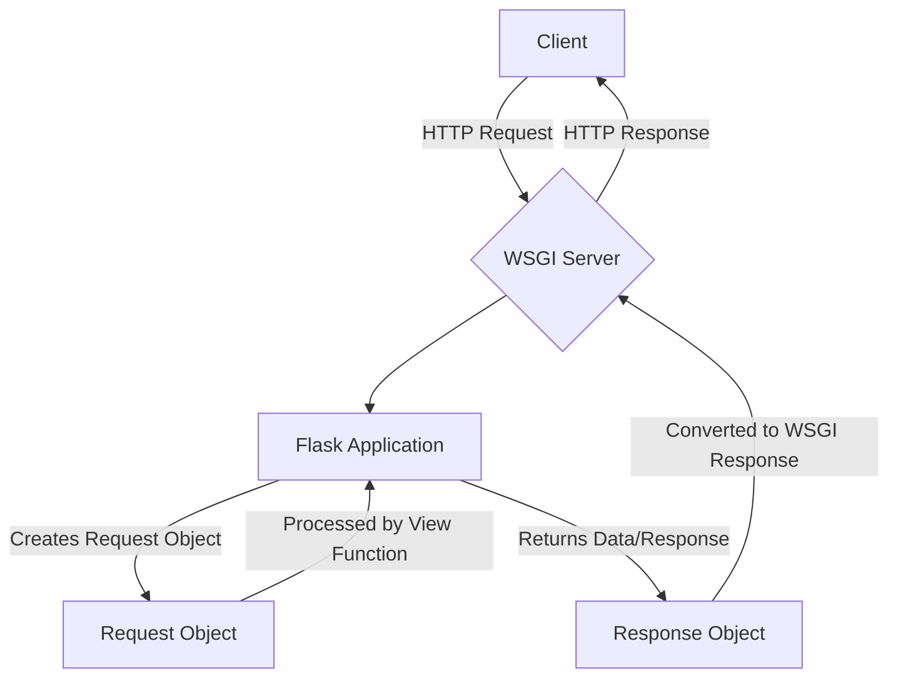

# Flask Wrappers Module

## Introduction

The `flask_wrappers` module in Flask provides the fundamental `Request` and `Response` objects, which are essential for handling HTTP communication within a Flask application. These objects abstract away the complexities of the underlying WSGI environment, offering a convenient and Pythonic interface for interacting with incoming client requests and constructing outgoing server responses.

## Purpose and Core Functionality

### Request Object

The `Request` object encapsulates all information about an incoming HTTP request from a client. It provides properties and methods to access various parts of the request, including:

*   **Headers**: Access to HTTP headers (e.g., `request.headers`).
*   **Method**: The HTTP method used (e.g., `GET`, `POST`, `PUT`, `DELETE`).
*   **URL Data**: The URL, path, query parameters (e.g., `request.path`, `request.args`).
*   **Form Data**: Data submitted via HTML forms (e.g., `request.form`).
*   **JSON Data**: JSON payload in the request body (e.g., `request.json`).
*   **Files**: Uploaded files (e.g., `request.files`).
*   **Cookies**: Client-sent cookies (e.g., `request.cookies`).
*   **Body Data**: Raw request body content.

This object makes it straightforward for developers to process client input and make decisions based on the request's characteristics.

### Response Object

The `Response` object is used to construct the HTTP response that will be sent back to the client. It allows developers to control:

*   **Content**: The body of the response (e.g., HTML, JSON, plain text).
*   **Status Code**: The HTTP status code (e.g., `200 OK`, `404 Not Found`, `500 Internal Server Error`).
*   **Headers**: HTTP headers to include in the response (e.g., `Content-Type`, `Set-Cookie`).
*   **Cookies**: Cookies to be set in the client's browser.

Flask automatically wraps return values from view functions into `Response` objects, but developers can also create and return `Response` objects directly for more fine-grained control.

## Architecture and Component Relationships

The `Request` and `Response` objects are central to the request-response cycle in Flask. They interact directly with the main Flask application instance and the WSGI server. The Flask application dispatches an incoming WSGI request into a `Request` object, processes it through view functions, and then converts the view function's return value into a `Response` object before sending it back via the WSGI server.

## How the Module Fits into the Overall System

`flask_wrappers` is a foundational module within the Flask ecosystem. Almost every interaction in a Flask application involves these two objects:

*   **Routing and Views**: View functions receive data via the `request` global proxy and construct responses, often implicitly, which are then converted into `Response` objects.
*   **Context Management**: The `Request` object is tied to the request context (see [flask_context.md](flask_context.md)), making it accessible via the `flask.request` proxy.
*   **Error Handling**: Custom error handlers often construct `Response` objects for error pages.
*   **Testing**: The `FlaskClient` (from [flask_testing.md](flask_testing.md)) internally uses these wrappers to simulate requests and inspect responses during testing.
*   **Extensions**: Many Flask extensions build upon or interact with the `Request` and `Response` objects to add functionality (e.g., authentication, logging, internationalization).

Essentially, `flask_wrappers` provides the core objects that enable Flask to function as a web framework, bridging the gap between raw HTTP and Python application logic.