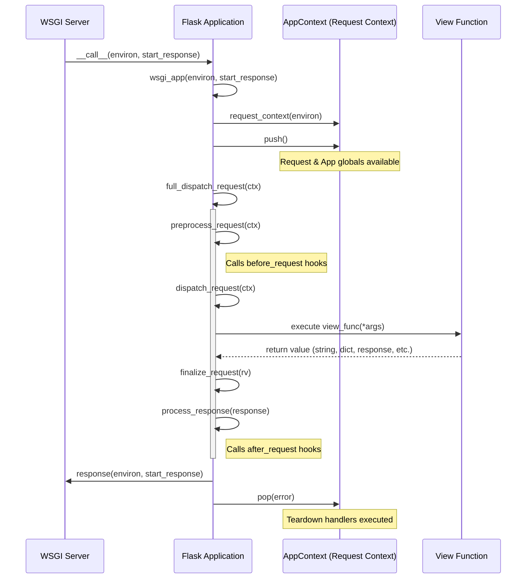
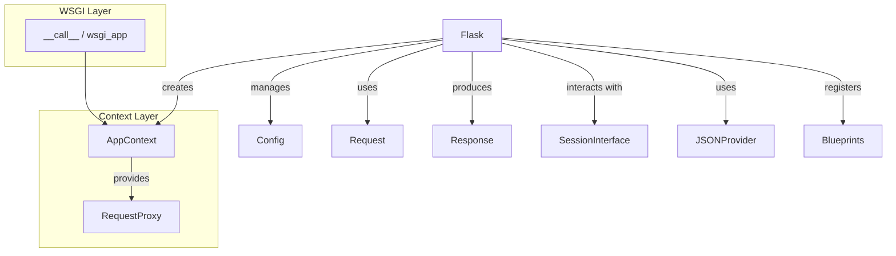

# Flask WSGI Module

## Introduction
The `flask_wsgi` module, centered around the `Flask` class, provides the core WSGI implementation for the Flask framework. It acts as the central registry for the application, handling request dispatching, routing, template configuration, and session management. By implementing the WSGI interface, it allows Flask applications to be served by any standard WSGI web server.

## Architecture and Components

### Core Class: Flask
The `Flask` class inherits from `App` (see [sansio_app.md](sansio_app.md)) and adds the WSGI-specific layer. It is the heart of every Flask application.

- **WSGI Entry Point**: Implements `__call__` and `wsgi_app` to handle incoming web requests. This allows the Flask object to be used directly by WSGI servers like Gunicorn or uWSGI.
- **Context Management**: Orchestrates the creation and lifecycle of application and request contexts via `AppContext` (see [ctx.md](ctx.md)). It ensures that globals like `current_app`, `request`, and `g` are available during a request.
- **Request/Response Handling**: Uses [wrappers.md](wrappers.md) (`Request` and `Response`) to encapsulate HTTP communication, providing a rich API for inspecting requests and building responses.
- **Routing**: Integrates with Werkzeug's routing system to map URLs to view functions, supporting dynamic URL parts and various HTTP methods.
- **Extension & Configuration**: Manages application configuration ([config.md](config.md)) and provides a unified interface for extensions to register themselves and interact with the application.
- **CLI Support**: Integrates with [cli.md](cli.md) via `AppGroup` to provide command-line management commands specific to the application.

### Dependencies and Sub-modules
- **Wrappers**: Handles the abstraction of HTTP requests and responses. (See [wrappers.md](wrappers.md))
- **Context**: Manages the thread-local (or context-local) storage for requests and application state. (See [ctx.md](ctx.md))
- **Sessions**: Provides mechanisms for persistent user sessions. (See [sessions.md](sessions.md))
- **JSON**: Provides JSON serialization and response support. (See [json.md](json.md))
- **Templating**: Integrates with Jinja2 for HTML rendering. (See [templating.md](templating.md))

## Request Lifecycle Flow

The following diagram illustrates how a WSGI request is processed by the `Flask` application from the moment it leaves the web server until the response is sent back.

## Component Interaction

This diagram shows the relationship between the `Flask` app and its primary supporting components during its operation.

## Key Methods and Functionality

### Request Dispatching
- `full_dispatch_request(ctx)`: The high-level request handler. It orchestrates `preprocess_request`, the actual `dispatch_request`, and finally `finalize_request`.
- `dispatch_request(ctx)`: Performs the URL matching. If a match is found, it calls the view function. It also handles automatic `OPTIONS` requests if configured.
- `finalize_request(rv, from_error_handler=False)`: Converts the return value (which might be a string, dict, or tuple) into a real `Response` object and runs `process_response`.

### Request Pre/Post Processing
- `preprocess_request(ctx)`: Runs all functions decorated with `@before_request`. If any returns a value, it stops further processing and uses that value as the response.
- `process_response(ctx, response)`: Runs all functions decorated with `@after_request`. It also triggers session saving via the `session_interface`.
- `do_teardown_request(ctx, exc)`: Runs all `@teardown_request` handlers. This is guaranteed to run even if an exception occurred.

### Context Management
- `app_context()`: Creates an `AppContext`. This is useful for scripts or tests that need to access `current_app` or `g` without an active HTTP request.
- `request_context(environ)`: Creates an `AppContext` populated with request information from a WSGI environment.
- `test_request_context(*args, **kwargs)`: A convenience method for creating a request context for testing purposes without needing a full WSGI environment.

### Error Handling
- `handle_exception(ctx, e)`: The final safety net for unhandled exceptions. It logs the error and returns a 500 response.
- `handle_user_exception(ctx, e)`: Handles exceptions during request processing. It checks for registered error handlers (for specific exception types or HTTP status codes).
- `handle_http_exception(ctx, e)`: Specifically deals with `HTTPException` (like 404 or 403). It allows for custom error pages for these standard errors.

## References
- [sansio_app.md](sansio_app.md): Base application logic and shared "Scaffold" functionality.
- [ctx.md](ctx.md): Deep dive into Application and Request contexts and their lifecycle.
- [wrappers.md](wrappers.md): Detailed information on Request and Response objects.
- [sessions.md](sessions.md): Configuration and implementation of session management.
- [config.md](config.md): How application configuration is managed and accessed.
- [blueprints.md](blueprints.md): Modular application design using Blueprints.
- [json.md](json.md): Support for JSON encoding/decoding and JSON responses.
- [cli.md](cli.md): Command-line interface integration and custom commands.
